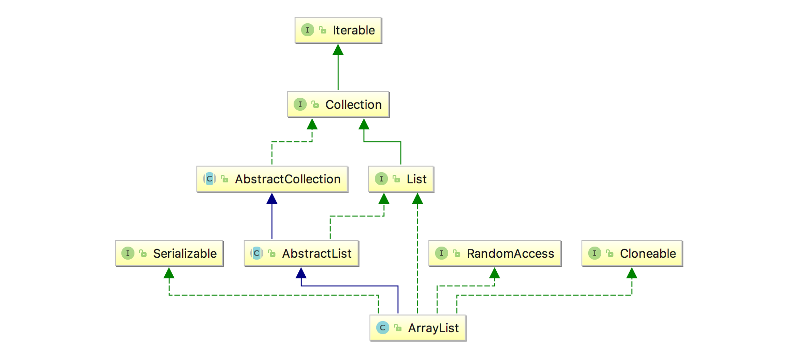

一、前言
在前面几篇，我们已经学习了常见了Map，下面开始阅读实现Collection接口的常见的实现类。在有了之前源码的铺垫之后，我们后面的阅读之路将会变得简单很多，因为很多Collection的结构与Map的类似，甚至有不少是直接用了Map里的方法。接下来让我们一起来看一下ArrayList的源码。

二、ArrayList结构概览
顾名思义，ArrayList的结构实际就是一个Object[]。所以它的特性很明显，插入一个元素的时候，是耗时是一个常量时间O(1)，在插入n个元素的时候，需要的时间就是O(n)。其他的操作中，运行的时间也是一个线性的增长（与数组中的元素个数有关）。

三、ArrayList源码阅读
3.1 ArrayList的继承关系

其中值得一提的是RandomAccess接口，该接口的目的是这么说的：

List 实现所使用的标记接口，用来表明其支持快速（通常是固定时间）随机访问。此接口的主要目的是允许一般的算法更改其行为，从而在将其应用到随机或连续访问列表时能提供良好的性能。

对于顺序访问的list，比如LinkedList，使用Iterator访问会比使用for-i来遍历list更快。这一点其实很好理解，当对于LinkedList使用get(i)的时候，由于是链表结构，所以每次都会从表头开始向下搜索，耗时肯定会多。

对于实现RandomAccess这个接口的类，如ArrayList，我们在遍历的时候，使用for(int i = 0; i < size; i++)来遍历，其速度比使用Iterator快（接口上是这么写的）。但是笔者看源码的时候，Iterator里使用的也是i++，这种遍历，无非是增加了fail-fast判断，估计就是这个导致了性能的差距，但是没有LinkedList这么大。笔者循环了 1000 * 1000 次，贴出比较结果，仅供参考，有兴趣的朋友们可以试一试，循环次数越多越明显：

----------now is arraylist----------
使用Iterator迭代一共花了19ms时间
使用for-i迭代一共花了9ms时间
----------now is linkedList----------
使用Iterator迭代一共花了17ms时间
使用for-i迭代一共花了434ms时间
而其继承的AbstractList主要给ArrayList提供了诸如add，get，set，remove的集合方法。

3.2 ArrayList的成员变量

    //初始化默认容量
    private static final int DEFAULT_CAPACITY = 10;
    // 空对象数组
    private static final Object[] EMPTY_ELEMENTDATA = {};
    // 默认容量的空对象数组
    private static final Object[] DEFAULTCAPACITY_EMPTY_ELEMENTDATA = {};
    // 实际存储对象的数组
    transient Object[] elementData;
    // 存储的数量
    private int size;
    // 数组能申请的最大数量
    private static final int MAX_ARRAY_SIZE = Integer.MAX_VALUE - 8;
特别说明一下： EMPTY_ELEMENTDATA 和 DEFAULTCAPACITY_EMPTY_ELEMENTDATA是为了在调用构造方法的时候，给elementData数组初始化，当elementData = DEFAULTCAPACITY_EMPTY_ELEMENTDATA的时候，当ArrayList第一次插入元素的时候，它的数组大小将会被初始化为DEFAULT_CAPACITY。而EMPTY_ELEMENTDATA可以理解为初始化的时候size=0，下面让我们看下构造方法，来更加清楚的理解。

3.3 ArrayList的构造方法
3.3.1 ArrayList()

    public ArrayList() {
      this.elementData = DEFAULTCAPACITY_EMPTY_ELEMENTDATA;
    }
当调用默认构造函数的时候，给elementData指向DEFAULTCAPACITY_EMPTY_ELEMENTDATA。

3.3.2 ArrayList(int initialCapacity)

    public ArrayList(int initialCapacity) {
      // 当 initialCapacity > 0 时，初始化对应大小的数组
      if (initialCapacity > 0) {
        this.elementData = new Object[initialCapacity];
      // 为 0 时，用指向EMPTY_ELEMENTDATA
      } else if (initialCapacity == 0) {
        this.elementData = EMPTY_ELEMENTDATA;
      } else {
        throw new IllegalArgumentException("Illegal Capacity: "+ initialCapacity);
      }
    }
这里当initialCapacity=0的时候，就是上述提到的情况。

3.3.3 ArrayList(Collection<? extends E> c)

    public ArrayList(Collection<? extends E> c) {
      elementData = c.toArray();
      if ((size = elementData.length) != 0) {
        // c.toArray不返回Object[]的时候，则进行数组拷贝
        if (elementData.getClass() != Object[].class)
          elementData = Arrays.copyOf(elementData, size, Object[].class);
      } else {
        // 如果为空，则指向EMPTY_ELEMENTDATA
        this.elementData = EMPTY_ELEMENTDATA;
      }
    }

3.4 ArrayList的重要方法
3.4.1 get(int index)
    
    public E get(int index) {
      rangeCheck(index);
      return elementData(index);
    }
    
    E elementData(int index) {
      return (E) elementData[index];
    }
get方法很简单，就是先检查index范围是否正确，正确的话从数组里取出元素。

    private void rangeCheck(int index) {
      // 如果index 大于 存储的个数，则抛出异常
      if (index >= size)
        // outOfBoundsMsg里面就是简单的字符串拼接。
        throw new IndexOutOfBoundsException(outOfBoundsMsg(index));
    }
这里值得一提的是：这里只判断了index >= size的情况，对于index < 0的情况没有判断，是因为在获取数组值的时候，如果为负数会抛出ArrayIndexOutOfBoundsException异常。

3.4.2 add(E e)
在看源码之前，我们先思考一个问题，往数组里添加元素的时候要注意什么：

对于刚初始化的数组，要初始化它的大小
判断数组大小是否足够，如果不够大，扩容
对于扩容要判断是否到达数组的最大数量
知道这些需要考虑之后，我们再来看看它的代码：

    public boolean add(E e) {
      //对上述的3个前提进行判断
      ensureCapacityInternal(size + 1);
      //赋值，然后指针走到下一个空位
      elementData[size++] = e;
      return true;
    }
我们接着来看ensureCapacityInternal()的方法代码：

    private void ensureCapacityInternal(int minCapacity) {
      // 上述情况一：初始化数组的大小
      if (elementData == DEFAULTCAPACITY_EMPTY_ELEMENTDATA) {
        // 取minCapacity和DEFAULT_CAPACITY中较大的那个
        minCapacity = Math.max(DEFAULT_CAPACITY, minCapacity);
      }
      // 检查有没有扩容的必要
      ensureExplicitCapacity(minCapacity);
    }
ensureCapacityInternal()方法的作用就是对构造方法初始化的数组进行处理。

再来看一下ensureExplicitCapacity()：

    private void ensureExplicitCapacity(int minCapacity) {
      // 修改次数的计数器(在AbstractList中定义的)
      modCount++;
      // 如果需要的空间大小 > 当前数组的长度，则进行扩容
      if (minCapacity - elementData.length > 0)
        grow(minCapacity);
    }
ensureExplicitCapacity()检查是否需要扩容。

    private void grow(int minCapacity) {
      // 记录旧的length
      int oldCapacity = elementData.length;
      // 扩容1.5倍, 位运算符效率更高
      int newCapacity = oldCapacity + (oldCapacity >> 1);
      // 判断有没有溢出
      if (newCapacity - minCapacity < 0)
        newCapacity = minCapacity;
      // 判断有没有超过最大的数组大小
      if (newCapacity - MAX_ARRAY_SIZE > 0)
        //计算最大的容量
        newCapacity = hugeCapacity(minCapacity);
      // 旧数组拷贝到新的大小数组
      elementData = Arrays.copyOf(elementData, newCapacity);
    }

    // 最大的容量
    private static int hugeCapacity(int minCapacity) {
      // 大小溢出
      if (minCapacity < 0)
        throw new OutOfMemoryError();
      // 需要的最小容量 > 数组最大的长度，则取Integer的最大值，否则取数组最大长度
      return (minCapacity > MAX_ARRAY_SIZE) ?
        Integer.MAX_VALUE :
      MAX_ARRAY_SIZE;
    }
最后的grow()扩容就是判断有没有超过数组的最大长度，以及对应的处理。

3.4.3 remove(int index)

    public E remove(int index) {
      rangeCheck(index);
      // 修改计数器
      modCount++;
      // 记录旧值，返回
      E oldValue = elementData(index);
      // 计算要往前移动的元素个数
      int numMoved = size - index - 1;
      //个数大于0，进行拷贝，从index+1开始，拷贝numMoved个，拷贝起始位置是index
      if (numMoved > 0)
        System.arraycopy(elementData, index+1, elementData, index,
                         numMoved);
      // 设置为null，以便GC
      elementData[--size] = null;
      return oldValue;
    }
对于被删除的元素，其后面的元素需要往前移。

3.4.4 remove(Object o)

    public boolean remove(Object o) {
      // 判断o为null，loop遍历找到为null的元素
      if (o == null) {
        for (int index = 0; index < size; index++)
          if (elementData[index] == null) {
            fastRemove(index);
            return true;
          }
      // 不为null
      } else {
        for (int index = 0; index < size; index++)
          if (o.equals(elementData[index])) {
            fastRemove(index);
            return true;
          }
      }
      return false;
    }

// 与上面的remove(int index) 类似

    private void fastRemove(int index) {
      modCount++;
      int numMoved = size - index - 1;
      if (numMoved > 0)
        System.arraycopy(elementData, index+1, elementData, index,
                         numMoved);
      elementData[--size] = null;
    }

3.4.5 set(int index, E element)

    public E set(int index, E element) {
      rangeCheck(index);
      // 记录旧的值
      E oldValue = elementData(index);
      //在原位置设置新的值
      elementData[index] = element;
      return oldValue;
    }
设置index位置的元素值为element，返回该位置的原来的值

3.4.6 addAll(Collection<? extends E> c)

    public boolean addAll(Collection<? extends E> c) {
      Object[] a = c.toArray();
      int numNew = a.length;
      // 对于新的最小长度进行判断处理
      ensureCapacityInternal(size + numNew);
      //将a数组，从index-0开始，拷贝numNew个，到elementData的size位置
      System.arraycopy(a, 0, elementData, size, numNew);
      //将size增加numNew个
      size += numNew;
      return numNew != 0;
    }

四、总结
ArrayList在随机访问的时候，数组的结构导致访问效率比较高，但是在指定位置插入，以及删除的时候，需要移动大量的元素，导致效率低下，在使用的时候要根据场景特点来选择，另外注意循环访问的方式选择。