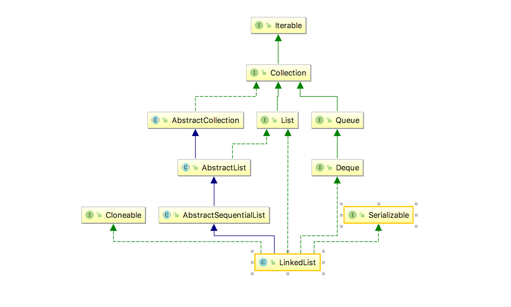
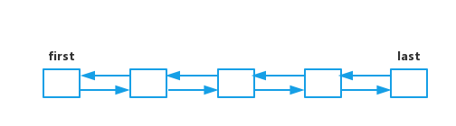

一、前言
这次我们来看一下常见的List中的第二个——LinkedList，在前面分析ArrayList的时候，我们提到，LinkedList是链表的结构，其实它跟我们在分析map的时候讲到的LinkedHashMap的结构有一定的相似，但是相对简单很多，今天再详细的看一下它的具体结构，以及使用的场景等。

二、LinkedList结构概览
在看具体的结构之前我们先来看一下它的继承关系：

与ArrayList不同的是，LinkedList继承了AbstractSequentialList，从Sequential这个单词可以看出，该抽象类实现的是顺序访问的结构，因为可以推测可能和链表有关。

另外值得注意的是Deque这个接口，这个类名字的由来是“double ended queue”，也就是双向队列，即从头部和尾部都可以进行队列的操作。

所以综上的话，我们可以知道，LinkedList是一个双向链表的数据结构：

从头部和尾部都可以对LinkedList进行遍历。

三、LinkedList源码阅读
3.1 LinkedList成员变量
    
    // list中的元素个数
    transient int size = 0;
    // 链表的头节点
    transient Node<E> first;
    // 链表的尾节点
    transient Node<E> last;
    其中叫做Node的内部类节点就是实现链表的关键：
    
    private static class Node<E> {
      // 实际存放的元素
      E item;
      // 后一个元素
      Node<E> next;
      // 前一个元素
      Node<E> prev;
      // 构造函数元素顺序分别为前，自己，后。就像排队一样
      Node(Node<E> prev, E element, Node<E> next) {
        this.item = element;
        this.next = next;
        this.prev = prev;
      }
    }

3.2 LinkedList构造方法
由于采用的是链表结构，所以LinkedList不像ArrayList一样，有指定容量的构造方法，所以这里主要说一下传集合的构造方法。
    
    public LinkedList(Collection<? extends E> c) {
      // 调用无参数的构造方法，其实里面什么都没有
      this();
      // 将c集合里的元素添加进list
      addAll(c);
    }
    考虑到addAll(Collection<? extends E> c)作为public方法，所以要考虑到在list已经存在元素的情况下，在链表末尾添加元素：
    
    public boolean addAll(Collection<? extends E> c) {
      return addAll(size, c);
    }
    
    public boolean addAll(int index, Collection<? extends E> c) {
      // 检查index是否在正确，即在0-size之间
      checkPositionIndex(index);
      // 将collection转为数组
      Object[] a = c.toArray();
      int numNew = a.length;
      if (numNew == 0)
        return false;
      // pred为前置元素， succ为后继元素
      Node<E> pred, succ;
      // 对pred，succ进行初始化。
      if (index == size) {
        // index == size，说明要插入元素的位置就在链表的末尾，后置元素为null，前一个元素就是last
        succ = null;
        pred = last;
      // index != size， 说明在链表的中间插入，这是pred为原来index的prev，succ为原来的元素
      } else {
        succ = node(index);
        pred = succ.prev;
      }
      // 搞清了前后元素的关系，就是遍历数组，逐个添加
      for (Object o : a) {
        @SuppressWarnings("unchecked") E e = (E) o;
        Node<E> newNode = new Node<>(pred, e, null);
        if (pred == null)
          first = newNode;
        else
          pred.next = newNode;
        pred = newNode;
      }
    
      // 如果后继元素为空，那么插入完后的最后一个元素，就prev就是last
      if (succ == null) {
        last = pred;
      // 否则就维护最后一个元素和之前的元素之间的关系
      } else {
        pred.next = succ;
        succ.prev = pred;
      }
      
      size += numNew;
      modCount++;
      return true;
    }
对于遍历Collection插入链表的逻辑应该是挺清晰的：

按照前-自己-后的关系调用Node的构造方法，进行初始化。
由于可能存在前一个元素pred为空的可能（构造函数调用），判断pred为空，则初始化的元素就是头节点
否则就维护pred与新节点newNode直接的关系。
将新节点作为pred，为下一个元素插入做准备
另外，作为双向链表，node(int index)方法也利用了这个特性，来更快的遍历：

    Node<E> node(int index) {
      // 如果index在链表的前半部分，则从头部节点开始遍历
      if (index < (size >> 1)) {
        Node<E> x = first;
        for (int i = 0; i < index; i++)
          x = x.next;
        return x;
      // 如果index在链表的后半部分，则从尾部节点开始遍历
      } else {
        Node<E> x = last;
        for (int i = size - 1; i > index; i--)
          x = x.prev;
        return x;
      }
    }
对于前半部分的元素采用从头开始遍历，后半段的元素采用尾部开始遍历。

3.3 LinkedList的重要方法
3.3.1 add(E e)
先说一下具体思路，作为链表结构，那么添加元素就是在链表的末尾插入元素，这个过程中要考虑：

末尾元素为null，该如何处理
    public boolean add(E e) {
      linkLast(e);
      return true;
    }
    
    void linkLast(E e) {
      // 记录last节点
      final Node<E> l = last;
      // 初始化新的节点
      final Node<E> newNode = new Node<>(l, e, null);
      last = newNode;
      // 对last节点进行判断
      if (l == null)
        first = newNode;
      else
        l.next = newNode;
      // 元素数量+1
      size++;
      // 添加修改次数
      modCount++;
    }
大体处理和LinkedHashMap的linkNodeLast差不多。

3.3.2 remove(Object o)
同样先说一下具体处理的思路：

由于插入的元素可能为null，所以要对o进行判断，否则不论是o为null还是遍历的时候元素为null，都会导致报空指针异常
找到元素后，对前后的元素关系重新维护，要考虑到元素是否在头尾的情况
    public boolean remove(Object o) {
      // 是否为空的判断
      if (o == null) {
        // 遍历链表寻找元素
        for (Node<E> x = first; x != null; x = x.next) {
          if (x.item == null) {
            // 找到后，重新维护删除元素的前后元素的关系
            unlink(x);
            return true;
          }
        }
      // 与上相同
      } else {
        for (Node<E> x = first; x != null; x = x.next) {
          if (o.equals(x.item)) {
            unlink(x);
            return true;
          }
        }
      }
      return false;
    }
在unlink的时候，就需要考虑前面提到的第二点：

    E unlink(Node<E> x) {
      final E element = x.item;
      // 记录前后元素
      final Node<E> next = x.next;
      final Node<E> prev = x.prev;
      // prev为null说明x节点为first节点，则删除后，next为first
      if (prev == null) {
        first = next;
      // 否则 prev的下一个元素为x的next
      } else {
        prev.next = next;
        // 设为null，方便prev的GC
        x.prev = null;
      }
      // 同上
      if (next == null) {
        last = prev;
      } else {
        next.prev = prev;
        // 设为null，方便next的GC
        x.next = null;
      }
      // 设为null，方便GC
      x.item = null;
      size--;
      modCount++;
      return element;
    }

3.3.3 listIterator(int index)
最后笔者再对迭代器中的实现做一下简要的分析。
    
    public Iterator<E> iterator() {
      // 调用AbstractList中的方法
      return listIterator();
    }
    
    public ListIterator<E> listIterator() {
      return listIterator(0);
    }
    iterator()调用的其实是listIterator()方法，对于不同的实现类，都会实现不同的方法。而在LinkedList中，是怎么样的呢：
    
    public ListIterator<E> listIterator(int index) {
      checkPositionIndex(index);
      return new ListItr(index);
    }
调用的是返回的是ListItr对象。

    private class ListItr implements ListIterator<E> {
      // 记录上次返回的元素
      private Node<E> lastReturned;
      // 记录下一个元素
      private Node<E> next;
      private int nextIndex;
      // 用来判断迭代过程中，是否有对元素的改动
      private int expectedModCount = modCount;
    
      ListItr(int index) {
        // 初始化next，以便在next方法中返回
        next = (index == size) ? null : node(index);
        nextIndex = index;
      }
    
      public boolean hasNext() {
        return nextIndex < size;
      }
    
      public E next() {
        // 判断是否有对元素的改动，有则抛出异常
        checkForComodification();
        if (!hasNext())
          throw new NoSuchElementException();
        // next()当中的next元素就是要返回的结果
        lastReturned = next;
        next = next.next;
        nextIndex++;
        return lastReturned.item;
      }
      
      final void checkForComodification() {
        if (modCount != expectedModCount)
          throw new ConcurrentModificationException();
      }
    }
从源码就就可以知道为什么我们在迭代的过程中对集合进行了修改，就会抛出异常，这么做的目的就是为了防止多线程操作同一个集合而出现的问题。

四、LinkedList的使用场景
LinkedList作为链表结构的特性，可以保证其在端点操作：如插入以及删除等，速度比ArrayList快，道理很简单，ArrayList在删除后，每次都要把后面的元素往前移（虽然采用的是拷贝方法），而LinkedList只要重新维护前后元素的关系就可以了。

引用Java编程思想里的话：

最佳的做法可能是将ArrayList作为默认选择，只有你需要使用额外的功能（个人理解为对Queue的操作），或者当程序的性能因为经常从表中间进行插入和删除而变差的时候，才去选择LinkedList。

五、总结
对于在集合中间进行频繁的插入和删除操作，或者需要使用队列特性的时候，我们可以考虑选用LinkedList。