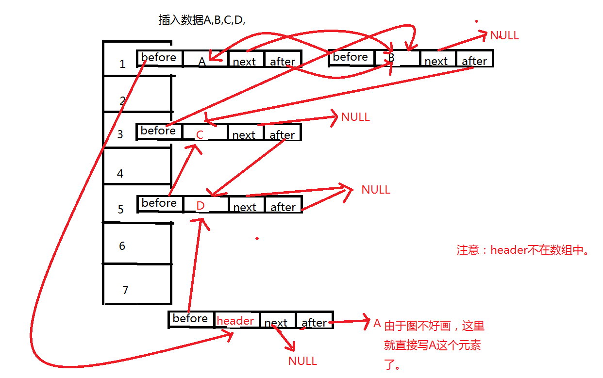
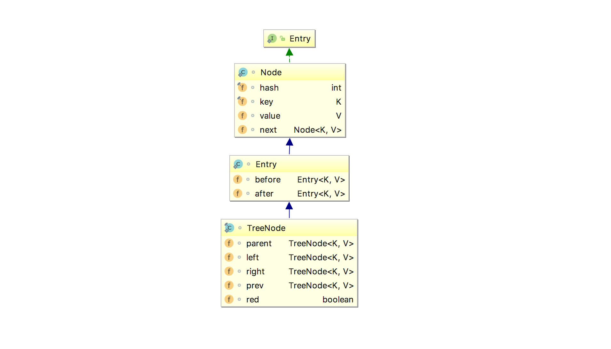
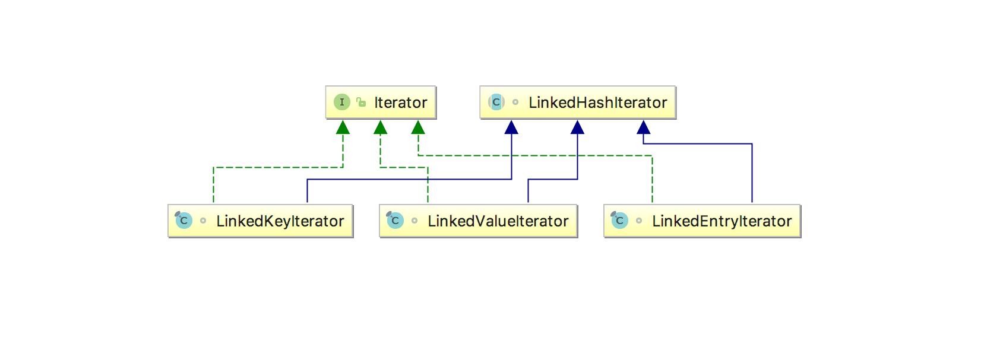
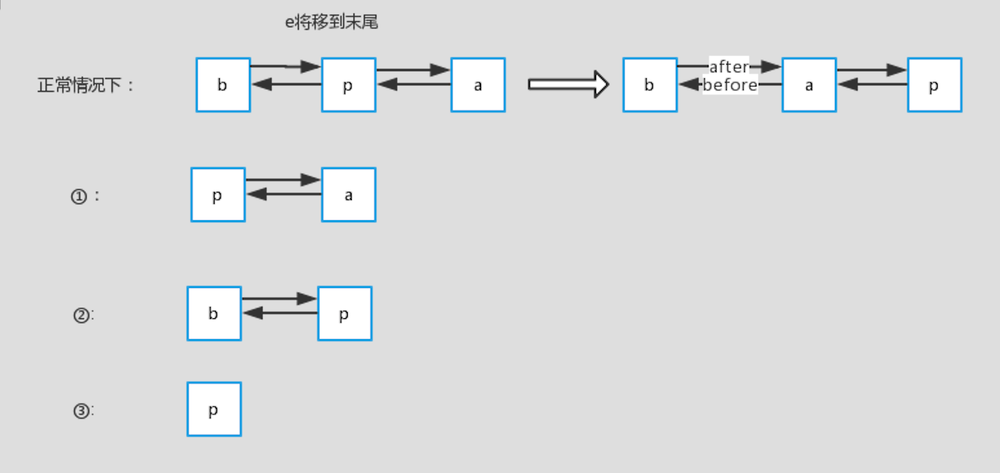

#一、前言
分析了HashMap的源码，里面涉及到了3个钩子函数，用来预设给子类——LinkedHashMap的调用

#二、LinkedHashMap的结构与继承关系

2.1 LinkedHashMap的数据结构



    可以从上图中看到，LinkedHashMap数据结构相比较于HashMap来说，添加了双向指针，分别指向前一个节点——before和后一个节点——after，从而将所有的节点已链表的形式串联一起来，从名字上来看LinkedHashMap与HashMap有一定的联系，实际上也确实是这样，LinkedHashMap继承了HashMap，重写了HashMap的一部分方法，从而加入了链表的实现。让我们来看一下它们的继承关系。

2.2 LinkedHashMap的继承关系

2.2.1 Entry的继承关系


 
    Entry作为基本的节点，可以看到LinkedHashMap的Entry继承自HashMap的Node，在其基础上加上了before和after两个指针，而TreeNode作为HashMap和LinkedHashMap的树节点，继承自LinkedHahsMap的Entry，并且加上了树节点的相关指针，另外提一点：before和parent的两个概念是不一样的，before是相对于链表来的，parent是相对于树操作来的，所以要分两个。


2.2.2 Iterator的继承关系


    LinkedHashMap的迭代器为遍历节点提供了自己的实现——LinkedHashIterator，对于Key、Value、Entry的3个迭代器，都继承自它。而且内部采用的遍历方式就是在前面提到的Entry里加的新的指向下一个节点的指针after，后面我们将具体看它的代码实现。
 
 #三、LinkedHashMap源码解析
 
 3.1 LinkedHashMap的继承关系
 

 ```java
 public class LinkedHashMap<K,V> extends HashMap<K,V> implements Map<K,V>

```

 3.2 LinkedHashMap的成员变量
 ```java
 private static final long serialVersionUID = 3801124242820219131L;
 
 // 用于指向双向链表的头部
 transient LinkedHashMap.Entry<K,V> head;
 //用于指向双向链表的尾部
 transient LinkedHashMap.Entry<K,V> tail;
 /**
  * 用来指定LinkedHashMap的迭代顺序，
  * true则表示按照基于访问的顺序来排列，意思就是最近使用的entry，放在链表的最末尾
  * false则表示按照插入顺序来
  */ 
 final boolean accessOrder;
```

 注意：accessOrder的final关键字，说明我们要在构造方法里给它初始化。
 
 3.3 LinkedHashMap的构造方法
 
 跟HashMap类似的构造方法这里就不一一赘述了，里面唯一的区别就是添加了前面提到的accessOrder，默认赋值为false——按照插入顺序来排列，这里主要说明一下不同的构造方法。
 ```java
 //多了一个 accessOrder的参数，用来指定按照LRU排列方式还是顺序插入的排序方式
 public LinkedHashMap(int initialCapacity,
                          float loadFactor,
                          boolean accessOrder) {
    super(initialCapacity, loadFactor);
    this.accessOrder = accessOrder;
  }
```

 3.4 LinkedHashMap的get()方法
 
 LinkedHashMap是怎么加上双向链表的呢，我们先来看一下get()方法
 ```java
 public V get(Object key) {
   Node<K,V> e;
   //调用HashMap的getNode的方法，详见上一篇HashMap源码解析
   if ((e = getNode(hash(key), key)) == null)
     return null;
   //在取值后对参数accessOrder进行判断，如果为true，执行afterNodeAccess
   if (accessOrder)
     afterNodeAccess(e);
   return e.value;
 }
```

     从上面的代码可以看到，LinkedHashMap的get方法，调用HashMap的getNode方法后，对accessOrder的值进行了判断，我们之前提到：
     
     accessOrder为true则表示按照基于访问的顺序来排列，意思就是最近使用的entry，放在链表的最末尾
     
     由此可见，afterNodeAccess(e)就是基于访问的顺序排列的关键，让我们来看一下它的代码：
 ```java
//此函数执行的效果就是将最近使用的Node，放在链表的最末尾
 void afterNodeAccess(Node<K,V> e) {
   LinkedHashMap.Entry<K,V> last;
   //仅当按照LRU原则且e不在最末尾，才执行修改链表，将e移到链表最末尾的操作
   if (accessOrder && (last = tail) != e) {
     //将e赋值临时节点p， b是e的前一个节点， a是e的后一个节点
     LinkedHashMap.Entry<K,V> p =
       (LinkedHashMap.Entry<K,V>)e, b = p.before, a = p.after;
     //设置p的后一个节点为null，因为执行后p在链表末尾，after肯定为null
     p.after = null;
     //p前一个节点不存在，情况一
     if (b == null) // ①
       head = a;
     else
       b.after = a;
     if (a != null) 
       a.before = b;
     //p的后一个节点不存在，情况二
     else // ②
       last = b;
     //情况三
     if (last == null) // ③
       head = p;
     //正常情况，将p设置为尾节点的准备工作，p的前一个节点为原先的last，last的after为p
     else {
       p.before = last;
       last.after = p;
     }
     //将p设置为将p设置为尾节点
     tail = p;
     // 修改计数器+1
     ++modCount;
   }
 }
```
 
    标注的情况如下图所示（特别说明一下，这里是显示链表的修改后指针的情况，实际上在桶里面的位置是不变的，只是前后的指针指向的对象变了）：
 
 
  下面来简单说明一下：
     
     正常情况下：查询的p在链表中间，那么将p设置到末尾后，它原先的前节点b和后节点a就变成了前后节点。
     
     情况一：p为头部，前一个节点b不存在，那么考虑到p要放到最后面，则设置p的后一个节点a为head
     情况二：p为尾部，后一个节点a不存在，那么考虑到统一操作，设置last为b
     情况三：p为链表里的第一个节点，head=p
 
 
 3.5 LinkedHashMap的put()方法
 
 接下来，让我们来看一下LinkedHashMap是怎么插入Entry的：LinkedHashMap的put方法调用的还是HashMap里的put，不同的是重写了里面的部分方法，一起来看一下：
 ```java
final V putVal(int hash, K key, V value, boolean onlyIfAbsent,
                    boolean evict) {
     ...
     tab[i] = newNode(hash, key, value, null);
     ...
     e = ((TreeNode<K,V>)p).putTreeVal(this, tab, hash, key, value);
     ...
     if ((e = p.next) == null) {
       p.next = newNode(hash, key, value, null);
     ...
         afterNodeAccess(e);
     ...
         afterNodeInsertion(evict);
       return null;
 }
```

 
 由于在上一章分析过了put方法，这里笔者就省略了部分代码，LinkedHashMap将其中newNode方法以及之前设置下的钩子方法afterNodeAccess和afterNodeInsertion进行了重写，从而实现了加入链表的目的。一起来看一下：
 ```java
 Node<K,V> newNode(int hash, K key, V value, Node<K,V> e) {
     //秘密就在于 new的是自己的Entry类，然后调用了linkedNodeLast
     LinkedHashMap.Entry<K,V> p =
       new LinkedHashMap.Entry<K,V>(hash, key, value, e);
     linkNodeLast(p);
     return p;
   }
   //顾名思义就是把新加的节点放在链表的最后面
     private void linkNodeLast(LinkedHashMap.Entry<K,V> p) {
       //将tail给临时变量last
       LinkedHashMap.Entry<K,V> last = tail;
       //把new的Entry给tail
       tail = p;
       //若没有last，说明p是第一个节点，head=p
       if (last == null)
         head = p;
       //否则就做准备工作，你懂的 (￣▽￣)"
       else {
         p.before = last;
         last.after = p;
       }
     }
     
     //这里笔者也把TreeNode的重写也加了进来，因为putTreeVal里有调用了这个
     TreeNode<K,V> newTreeNode(int hash, K key, V value, Node<K,V> next) {
       TreeNode<K,V> p = new TreeNode<K,V>(hash, key, value, next);
       linkNodeLast(p);
       return p;
     }
     
     //插入后把最老的Entry删除，不过removeEldestEntry总是返回false，所以不会删除，估计又是一个钩子方法给子类用的
     void afterNodeInsertion(boolean evict) {
       LinkedHashMap.Entry<K,V> first;
       if (evict && (first = head) != null && removeEldestEntry(first)) {
         K key = first.key;
         removeNode(hash(key), key, null, false, true);
       }
     }
     
     protected boolean removeEldestEntry(Map.Entry<K,V> eldest) {
       return false;
     }
```

 总结：设计者灵活的运用了Override，以及设置的钩子方法，实现了双向链表。
 

 3.6 LinkedHashMap的remove()
 
 上一章我们提到过remove里面设计者也设置了一个钩子方法：
 ```java
final Node<K,V> removeNode(int hash, Object key, Object value,
                                boolean matchValue, boolean movable) {
   ...
       //node即是要删除的节点
       afterNodeRemoval(node);
   ...
 }
 一起来看一下这个方法干了什么：
 
 void afterNodeRemoval(Node<K,V> e) {
   //与afterNodeAccess一样，记录e的前后节点b，a
   LinkedHashMap.Entry<K,V> p =
     (LinkedHashMap.Entry<K,V>)e, b = p.before, a = p.after;
   //p已删除，前后指针都设置为null，便于GC回收
   p.before = p.after = null;
   //与afterNodeAccess一样类似，一顿判断，然后b，a互为前后节点
   if (b == null)
     head = a;
   else
     b.after = a;
   if (a == null)
     tail = b;
   else
     a.before = b;
 }
```
 
 remove里的相对简单，顺带着简单提一提。
 

 3.7 LinkedHashMap的迭代器
 
 这一节，让我们来看一下LinkedHashMap的最基础的迭代器——LinkedHashIterator
 ```java
abstract class LinkedHashIterator {
   //记录下一个Entry
   LinkedHashMap.Entry<K,V> next;
   //记录当前的Entry
   LinkedHashMap.Entry<K,V> current;
   //记录是否发生了迭代过程中的修改
   int expectedModCount;
 
   LinkedHashIterator() {
     //初始化的时候把head给next
     next = head;
     expectedModCount = modCount;
     current = null;
   }
 
   public final boolean hasNext() {
     return next != null;
   }
 
   //这里采用的是链表方式的遍历方式，有兴趣的园友可以去上一章看看HashMap的遍历方式
   final LinkedHashMap.Entry<K,V> nextNode() {
     LinkedHashMap.Entry<K,V> e = next;
     if (modCount != expectedModCount)
       throw new ConcurrentModificationException();
     if (e == null)
       throw new NoSuchElementException();
     //记录当前的Entry
     current = e;
     //直接拿after给next
     next = e.after;
     return e;
   }
 
   public final void remove() {
     Node<K,V> p = current;
     if (p == null)
       throw new IllegalStateException();
     if (modCount != expectedModCount)
       throw new ConcurrentModificationException();
     current = null;
     K key = p.key;
     removeNode(hash(key), key, null, false, false);
     expectedModCount = modCount;
   }
 }
```
 
 LinkedHashMap遍历的方式使链表，顺序访问的话速度应该会更快一些。
 
 
