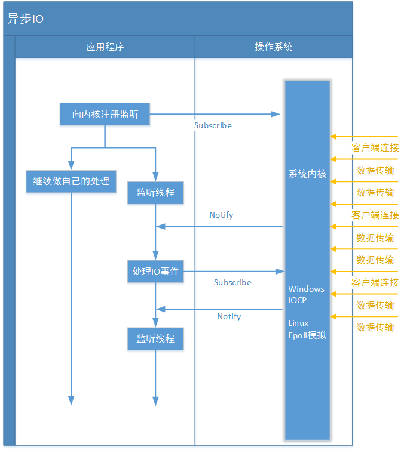
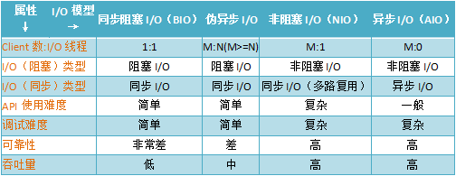

3、AIO编程

　　NIO 2.0引入了新的异步通道的概念，并提供了异步文件通道和异步套接字通道的实现。

　　异步的套接字通道时真正的异步非阻塞I/O，对应于UNIX网络编程中的事件驱动I/O（AIO）。他不需要过多的Selector对注册的通道进行轮询即可实现异步读写，从而简化了NIO的编程模型。

　　异步IO则是采用“订阅-通知”模式：即应用程序向操作系统注册IO监听，然后继续做自己的事情。当操作系统发生IO事件，并且准备好数据后，在主动通知应用程序，触发相应的函数：



　　和同步IO一样，异步IO也是由操作系统进行支持的。微软的windows系统提供了一种异步IO技术：IOCP（I/O Completion Port，I/O完成端口）（Windows下负责实现套接字通道的具体类是“sun.nio.ch.WindowsAsynchronousSocketChannelImpl”），Linux下由于没有这种异步IO技术，所以使用的是epoll（上文介绍过的一种多路复用IO技术的实现）对异步IO进行模拟。

　　在JAVA NIO框架中，我们说到了一个重要概念“selector”（选择器）。它负责代替应用查询中所有已注册的通道到操作系统中进行IO事件轮询、管理当前注册的通道集合，定位发生事件的通道等操操作；但是在JAVA AIO框架中，由于应用程序不是“轮询”方式，而是订阅-通知方式，所以不再需要“selector”（选择器）了，改由channel通道直接到操作系统注册监听。JAVA NIO和JAVA AIO框架，除了因为操作系统的实现不一样而去掉了Selector外，其他的重要概念都是存在的，例如上文中提到的Channel的概念，还有演示代码中使用的Buffer缓存方式。

　　JAVA AIO框架中，只实现了两种网络IO通道“AsynchronousServerSocketChannel”（服务器监听通道）、“AsynchronousSocketChannel”（socket套接字通道）。但是无论哪种通道他们都有独立的fileDescriptor（文件标识符）、attachment（附件，附件可以使任意对象，类似“通道上下文”），并被独立的SocketChannelReadHandle类实例引用。

　　直接上代码吧。

 3.1、Server端代码
 
　　Server：

```java
public class AioServer {
    private static int DEFAULT_PORT = 12345;

    private static AsyncServerHandler serverHandle;

    public volatile static long clientCount = 0;

    public static void start(){

        start(DEFAULT_PORT);

    }

    public static synchronized void start(int port){

        if(serverHandle!=null)

            return;

        serverHandle = new AsyncServerHandler(port);

        new Thread(serverHandle,"Server").start();

    }

    public static void main(String[] args){

        start();

    }
}
```

　　AsyncServerHandler:

```java
public class AsyncServerHandler implements Runnable {

    public CountDownLatch latch;

    public AsynchronousServerSocketChannel channel;

    public AsyncServerHandler(int port) {

        try {

//创建服务端通道

            channel = AsynchronousServerSocketChannel.open();

//绑定端口

            channel.bind(new InetSocketAddress(port));

            System.out.println("服务器已启动，端口号：" + port);

        } catch (IOException e) {

            e.printStackTrace();

        }

    }

    @Override

    public void run() {

//CountDownLatch初始化

//它的作用：在完成一组正在执行的操作之前，允许当前的现场一直阻塞

//此处，让现场在此阻塞，防止服务端执行完成后退出

//也可以使用while(true)+sleep

//生成环境就不需要担心这个问题，以为服务端是不会退出的

        latch = new CountDownLatch(1);

//用于接收客户端的连接

        channel.accept(this,new AcceptHandler());

        try {

            latch.await();

        } catch (InterruptedException e) {

            e.printStackTrace();

        }

    }

}
```

　　AcceptHandler：
```java

//作为handler接收客户端连接
public class AcceptHandler implements CompletionHandler<AsynchronousSocketChannel, AsyncServerHandler> {

    @Override

    public void completed(AsynchronousSocketChannel channel,AsyncServerHandler serverHandler) {

//继续接受其他客户端的请求

        AioServer.clientCount++;

        System.out.println("连接的客户端数：" + AioServer.clientCount);

        serverHandler.channel.accept(serverHandler, this);

//创建新的Buffer

        ByteBuffer buffer = ByteBuffer.allocate(1024);

//异步读 第三个参数为接收消息回调的业务Handler

        channel.read(buffer, buffer, new ReadHandler(channel));

    }

    @Override

    public void failed(Throwable exc, AsyncServerHandler serverHandler) {

        exc.printStackTrace();

        serverHandler.latch.countDown();

    }

}
```

　　ReadHandler2:
```java
public class ReadHandler2 implements CompletionHandler<Integer, ByteBuffer> {

//用于读取半包消息和发送应答

    private AsynchronousSocketChannel channel;

    public ReadHandler2(AsynchronousSocketChannel channel) {

        this.channel = channel;

    }

//读取到消息后的处理

    @Override

    public void completed(Integer result, ByteBuffer attachment) {

//flip操作

        attachment.flip();

//根据

        byte[] message = new byte[attachment.remaining()];

        attachment.get(message);

        try {

            String expression = new String(message, "UTF-8");

            System.out.println("服务器收到消息: " + expression);

            String calrResult = null;

            try{

                calrResult = Calculator.cal(expression).toString();

            }catch(Exception e){

                calrResult = "计算错误：" + e.getMessage();

            }

//向客户端发送消息

            doWrite(calrResult);

        } catch (UnsupportedEncodingException e) {

            e.printStackTrace();

        }

    }

//发送消息

    private void doWrite(String result) {

        byte[] bytes = result.getBytes();

        ByteBuffer writeBuffer = ByteBuffer.allocate(bytes.length);

        writeBuffer.put(bytes);

        writeBuffer.flip();

//异步写数据 参数与前面的read一样

        channel.write(writeBuffer, writeBuffer,new CompletionHandler<Integer, ByteBuffer>() {

            @Override

            public void completed(Integer result, ByteBuffer buffer) {

//如果没有发送完，就继续发送直到完成

                if (buffer.hasRemaining())

                    channel.write(buffer, buffer, this);

                else{

//创建新的Buffer

                    ByteBuffer readBuffer = ByteBuffer.allocate(1024);

//异步读 第三个参数为接收消息回调的业务Handler

                    channel.read(readBuffer, readBuffer, new ReadHandler2(channel));

                }

            }

            @Override

            public void failed(Throwable exc, ByteBuffer attachment) {

                try {

                    channel.close();

                } catch (IOException e) {

                }

            }

        });

    }

    @Override

    public void failed(Throwable exc, ByteBuffer attachment) {

        try {

            this.channel.close();

        } catch (IOException e) {

            e.printStackTrace();

        }

    }

}
```

3.2、Client端代码

　　Client：

```java
public class AioClient {
    private static String DEFAULT_HOST = "127.0.0.1";

    private static int DEFAULT_PORT = 12345;

    private static AsyncClientHandler clientHandle;

    public static void start(){

        start(DEFAULT_HOST,DEFAULT_PORT);

    }

    public static synchronized void start(String ip,int port){

        if(clientHandle!=null)

            return;

        clientHandle = new AsyncClientHandler(ip,port);

        new Thread(clientHandle,"Client").start();

    }

//向服务器发送消息

    public static boolean sendMsg(String msg) throws Exception{

        if(msg.equals("q")) return false;

        clientHandle.sendMsg(msg);

        return true;

    }


    public static void main(String[] args) throws Exception{

        start();

        System.out.println("请输入请求消息：");

        Scanner scanner = new Scanner(System.in);

        while(sendMsg(scanner.nextLine()));

    }
}
```

　　AsyncClientHandler：

```java
public class AsyncClientHandler implements CompletionHandler<Void, AsyncClientHandler>, Runnable {

    private AsynchronousSocketChannel clientChannel;

    private String host;

    private int port;

    private CountDownLatch latch;

    public AsyncClientHandler(String host, int port) {

        this.host = host;

        this.port = port;

        try {

//创建异步的客户端通道

            clientChannel = AsynchronousSocketChannel.open();

        } catch (IOException e) {

            e.printStackTrace();

        }

    }

    @Override

    public void run() {

//创建CountDownLatch等待

        latch = new CountDownLatch(1);

//发起异步连接操作，回调参数就是这个类本身，如果连接成功会回调completed方法

        clientChannel.connect(new InetSocketAddress(host, port), this, this);

        try {

            latch.await();

        } catch (InterruptedException e1) {

            e1.printStackTrace();

        }

        try {

            clientChannel.close();

        } catch (IOException e) {

            e.printStackTrace();

        }

    }

//连接服务器成功

//意味着TCP三次握手完成

    @Override

    public void completed(Void result, AsyncClientHandler attachment) {

        System.out.println("客户端成功连接到服务器...");

    }

//连接服务器失败

    @Override

    public void failed(Throwable exc, AsyncClientHandler attachment) {

        System.err.println("连接服务器失败...");

        exc.printStackTrace();

        try {

            clientChannel.close();

            latch.countDown();

        } catch (IOException e) {

            e.printStackTrace();

        }

    }

//向服务器发送消息

    public void sendMsg(String msg){

        byte[] req = msg.getBytes();

        ByteBuffer writeBuffer = ByteBuffer.allocate(req.length);

        writeBuffer.put(req);

        writeBuffer.flip();

//异步写

        clientChannel.write(writeBuffer, writeBuffer,new WriteHandler(clientChannel, latch));

    }

}
```

　　WriteHandler：

```java
public class WriteHandler implements CompletionHandler<Integer, ByteBuffer> {

    private AsynchronousSocketChannel clientChannel;

    private CountDownLatch latch;

    public WriteHandler(AsynchronousSocketChannel clientChannel,CountDownLatch latch) {

        this.clientChannel = clientChannel;

        this.latch = latch;

    }

    @Override

    public void completed(Integer result, ByteBuffer buffer) {

//完成全部数据的写入

        if (buffer.hasRemaining()) {

            clientChannel.write(buffer, buffer, this);

        }

        else {

//读取数据

            ByteBuffer readBuffer = ByteBuffer.allocate(1024);

            clientChannel.read(readBuffer,readBuffer,new ReadHandler(clientChannel, latch));

        }

    }

    @Override

    public void failed(Throwable exc, ByteBuffer attachment) {

        System.err.println("数据发送失败...");

        try {

            clientChannel.close();

            latch.countDown();

        } catch (IOException e) {

        }

    }

}
```

　　ReadHandler：

```java
public class ReadHandler implements CompletionHandler<Integer, ByteBuffer> {

    private AsynchronousSocketChannel clientChannel;

    private CountDownLatch latch;

    public ReadHandler(AsynchronousSocketChannel clientChannel,CountDownLatch latch) {

        this.clientChannel = clientChannel;

        this.latch = latch;

    }

    @Override

    public void completed(Integer result,ByteBuffer buffer) {

        buffer.flip();

        byte[] bytes = new byte[buffer.remaining()];

        buffer.get(bytes);

        String body;

        try {

            body = new String(bytes,"UTF-8");

            System.out.println("客户端收到结果:"+ body);

        } catch (UnsupportedEncodingException e) {

            e.printStackTrace();

        }

    }

    @Override

    public void failed(Throwable exc,ByteBuffer attachment) {

        System.err.println("数据读取失败...");

        try {

            clientChannel.close();

            latch.countDown();

        } catch (IOException e) {

        }

    }

}
```

 3.3、测试
 
　　Test：

```java
public class AioTest {
    
    //测试主方法
    public static void main(String[] args) throws Exception{

        //运行服务器

        AioServer.start();

        //避免客户端先于服务器启动前执行代码

        Thread.sleep(100);

        //运行客户端

        AioClient.start();

        System.out.println("请输入请求消息：");

        Scanner scanner = new Scanner(System.in);

        while(AioClient.sendMsg(scanner.nextLine()));

    }
}
```

　　我们可以在控制台输入我们需要计算的算数字符串，服务器就会返回结果，当然，我们也可以运行大量的客户端，都是没有问题的，以为此处设计为单例客户端，所以也就没有演示大量客户端并发。

　　读者可以自己修改Client类，然后开辟大量线程，并使用构造方法创建很多的客户端测试。

　　下面是其中一次参数的输出：

    服务器已启动，端口号：12345
    
    请输入请求消息：
    
    客户端成功连接到服务器...
    
    连接的客户端数：1
    
    123456+789+456
    
    服务器收到消息: 123456+789+456
    
    客户端收到结果:124701
    
    9526*56
    
    服务器收到消息: 9526*56
    
    客户端收到结果:533456
    
 
 　　AIO是真正的异步非阻塞的，所以，在面对超级大量的客户端，更能得心应手。
 
　　下面就比较一下，几种I/O编程的优缺点。
 
 4、各种I/O的对比
 
　　先以一张表来直观的对比一下：



　　具体选择什么样的模型或者NIO框架，完全基于业务的实际应用场景和性能需求，如果客户端很少，服务器负荷不重，就没有必要选择开发起来相对不那么简单的NIO做服务端；相反，就应考虑使用NIO或者相关的框架了。

6. Netty和Mina展望

　　既然JAVA NIO / JAVA AIO已经实现了各主流操作系统的底层支持，那么为什么现在主流的JAVA NIO技术会是Netty和MINA呢？答案很简单：因为更好用，这里举几个方面的例子：

    1. 虽然JAVA NIO 和 JAVA AIO框架提供了 多路复用IO/异步IO的支持，但是并没有提供上层“信息格式”的良好封装。例如前两者并没有提供针对Protocol Buffer、JSON这些信息格式的封装，但是Netty框架提供了这些数据格式封装（基于责任链模式的编码和解码功能）
    2. 要编写一个可靠的、易维护的、高性能的（注意它们的排序）NIO/AIO 服务器应用。除了框架本身要兼容实现各类操作系统的实现外。更重要的是它应该还要处理很多上层特有服务，例如：客户端的权限、还有上面提到的信息格式封装、简单的数据读取。这些Netty框架都提供了响应的支持。
    3. JAVA NIO框架存在一个poll/epoll bug：Selector doesn’t block on Selector.select(timeout)，不能block意味着CPU的使用率会变成100%（这是底层JNI的问题，上层要处理这个异常实际上也好办）。当然这个bug只有在Linux内核上才能重现。
    4. 这个问题在JDK 1.7版本中还没有被完全解决：http://bugs.java.com/bugdatabase/view_bug.do?bug_id=2147719。虽然Netty 4.0中也是基于JAVA NIO框架进行封装的（上文中已经给出了Netty中NioServerSocketChannel类的介绍），但是Netty已经将这个bug进行了处理。
    