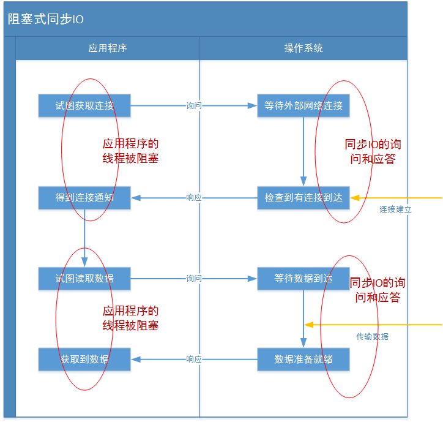

1、BIO编程

1.1、传统的BIO编程

　　网络编程的基本模型是C/S模型，即两个进程间的通信。

　　服务端提供IP和监听端口，客户端通过连接操作想服务端监听的地址发起连接请求，通过三次握手连接，如果连接成功建立，双方就可以通过套接字进行通信。

　　传统的同步阻塞模型开发中，ServerSocket负责绑定IP地址，启动监听端口；Socket负责发起连接操作。连接成功后，双方通过输入和输出流进行同步阻塞式通信。 

　　简单的描述一下BIO的服务端通信模型：采用BIO通信模型的服务端，通常由一个独立的Acceptor线程负责监听客户端的连接，它接收到客户端连接请求之后为每个客户端创建一个新的线程进行链路处理没处理完成后，通过输出流返回应答给客户端，线程销毁。
即典型的一请求一应答通信模型。

　　传统BIO通信模型图：




　　该模型最大的问题就是缺乏弹性伸缩能力，当客户端并发访问量增加后，服务端的线程个数和客户端并发访问数呈1:1的正比关系，Java中的线程也是比较宝贵的系统资源，线程数量快速膨胀后，系统的性能将急剧下降，随着访问量的继续增大，系统最终就死-掉-了。

　　同步阻塞式I/O创建的Server源码：其中serverSocket.accept();是阻塞的

```java
/**
 * Create by  GF  in  17:03 2019/1/21
 * Description:客户端线程,用于处理一个客户端的Socket链路
 * Modified  By:
 */

public class BioServer {

    private static int SERVER_PORT = 5125;

    private static SimpleDateFormat simpleDateFormat = new SimpleDateFormat("YYYY-MM-DD HH:mm:ss");

    public static void main(String[] args) {

        BufferedReader in = null;
        PrintWriter out = null;
        ServerSocket serverSocket = null;
        try {
            serverSocket = new ServerSocket(SERVER_PORT);
            System.out.println(simpleDateFormat.format(new Date()) + "-------------------------服务端已启动。。。");
            Socket socket = serverSocket.accept();//阻塞
            //当第一个客户端连接进来过后就会执行这句话,
            System.out.println("accept方法通过了....");

            //这个程序如果没有第二个客户端连进,那以下的代码不会执行到的.
            Socket socket2 = serverSocket.accept();
            System.out.println("accept2方法通过了....");

            in = new BufferedReader(new InputStreamReader(socket.getInputStream()));
            out = new PrintWriter(socket.getOutputStream(),true);

            String result = "";
            while (true){
                if((result=in.readLine()) == null) break;
                System.out.println(simpleDateFormat.format(new Date()) + "-------------------------客户端1:"+result);

                System.out.print(simpleDateFormat.format(new Date()) + "-------------------------服务端,我：");
                Scanner sc = new Scanner(System.in);
                String info = sc.nextLine();
                out.println(info);
            }
            /**
             * 程序有一种情况可以执行到这里,就是socket客户端口断开.不是socket2断开
             * 第一个连接断开后line=reader.readLine();就不会在阻塞了.流中的数据读
             * 完过后跳就跳出了while向下执行了.
             */
            System.out.println("程序结束了");
        } catch (IOException e) {
            e.printStackTrace();
        }finally {
            if(in!=null){
                try {
                    in.close();
                } catch (IOException e) {
                    e.printStackTrace();
                }
                in = null;
            }
            if(out!=null){
                out.close();
                out = null;
            }
        }
    }
}
```

accept底层源码：
```java
AbstractPlainSocketImpl
    protected void accept(SocketImpl s) throws IOException {
        acquireFD();
        try {
            socketAccept(s);
        } finally {
            releaseFD();
        }
    }
/*
     * "Acquires" and returns the FileDescriptor for this impl
     *
     * A corresponding releaseFD is required to "release" the
     * FileDescriptor.
 */
    FileDescriptor acquireFD() {
        synchronized (fdLock) {
            fdUseCount++;
            return fd;
        }
    }
/*
     * "Release" the FileDescriptor for this impl.
     *
     * If the use count goes to -1 then the socket is closed.
     */
    void releaseFD() {
        synchronized (fdLock) {
            fdUseCount--;
            if (fdUseCount == -1) {
                if (fd != null) {
                    try {
                        socketClose();
                    } catch (IOException e) {
                    } finally {
                        fd = null;
                    }
                }
            }
        }
    }
        
        TwoStacksPlainSocketImpl
        native void socketAccept(SocketImpl s) throws IOException;


```


　　同步阻塞式I/O创建的Client源码：
```java
public class BioServer {

    private static int SERVER_PORT = 5125;

    private static SimpleDateFormat simpleDateFormat = new SimpleDateFormat("YYYY-MM-DD HH:mm:ss");

    public static void main(String[] args) {

        BufferedReader in = null;
        PrintWriter out = null;
        ServerSocket serverSocket = null;
        try {
            serverSocket = new ServerSocket(SERVER_PORT);
            System.out.println(simpleDateFormat.format(new Date()) + "-------------------------服务端已启动。。。");
            while (true){
                Socket socket = serverSocket.accept();
                in = new BufferedReader(new InputStreamReader(socket.getInputStream()));
                out = new PrintWriter(socket.getOutputStream(),true);

                String result = "";
                if((result=in.readLine()) == null) break;
                System.out.println(simpleDateFormat.format(new Date()) + "-------------------------客户端:"+result);

                System.out.print(simpleDateFormat.format(new Date()) + "-------------------------服务端,我：");
                Scanner sc = new Scanner(System.in);
                String info = sc.nextLine();
                out.println(info);
            }
        } catch (IOException e) {
            e.printStackTrace();
        }finally {
            if(in!=null){
                try {
                    in.close();
                } catch (IOException e) {
                    e.printStackTrace();
                }
                in = null;
            }
            if(out!=null){
                out.close();
                out = null;
            }
        }
    }
}
```
1.2、伪异步I/O编程
 

　　为了改进这种一连接一线程的模型，我们可以使用线程池来管理这些线程（需要了解更多请参考前面提供的文章），实现1个或多个线程处理N个客户端的模型（但是底层还是使用的同步阻塞I/O），通常被称为“伪异步I/O模型“。

　　伪异步I/O模型图：


```java
public class ServerBetter {

    //默认的端口号
    private static int DEFAULT_PORT = 12345;
    //单例的ServerSocket
    private static ServerSocket server;
    //线程池 懒汉式的单例
    private static ExecutorService executorService = Executors.newFixedThreadPool(60);
    //根据传入参数设置监听端口，如果没有参数调用以下方法并使用默认值
    public static void start() throws IOException {
        //使用默认值
        start(DEFAULT_PORT);
    }
    //这个方法不会被大量并发访问，不太需要考虑效率，直接进行方法同步就行了
    public synchronized static void start(int port) throws IOException{
        if(server != null) return;
        try{
            //通过构造函数创建ServerSocket
            //如果端口合法且空闲，服务端就监听成功
            server = new ServerSocket(port);
            System.out.println("服务器已启动，端口号：" + port);
            //通过无线循环监听客户端连接
            //如果没有客户端接入，将阻塞在accept操作上。
            while(true){
                Socket socket = server.accept();
                //当有新的客户端接入时，会执行下面的代码
                //然后创建一个新的线程处理这条Socket链路
                executorService.execute(new ServerHandler(socket));
            }
        }finally{
            //一些必要的清理工作
            if(server != null){
                System.out.println("服务器已关闭。");
                server.close();
                server = null;
            }
        }
    }

}
```

 　　测试运行结果是一样的。

　　我们知道，如果使用CachedThreadPool线程池（不限制线程数量，如果不清楚请参考文首提供的文章），其实除了能自动帮我们管理线程（复用），看起来也就像是1:1的客户端：线程数模型，而使用FixedThreadPool我们就有效的控制了线程的最大数量，保证了系统有限的资源的控制，实现了N:M的伪异步I/O模型。

　　但是，正因为限制了线程数量，如果发生大量并发请求，超过最大数量的线程就只能等待，直到线程池中的有空闲的线程可以被复用。而对Socket的输入流就行读取时，会一直阻塞，直到发生：

    有数据可读
    可用数据以及读取完毕
    发生空指针或I/O异常
    
　　所以在读取数据较慢时（比如数据量大、网络传输慢等），大量并发的情况下，其他接入的消息，只能一直等待，这就是最大的弊端。

　　


