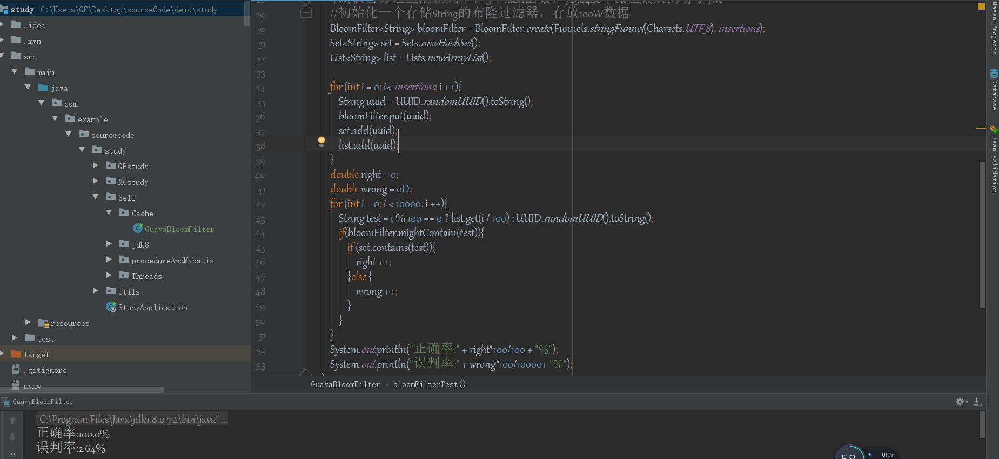

基础理论知识：

位运算

1.与运算（&）

　　参加运算的两个数据，按二进制位进行“与”运算。

运算规则：0&0=0;   0&1=0;    1&0=0;     1&1=1;

    即：两位同时为“1”，结果才为“1”，否则为0

    例如：3&5  即 0000 0011 & 0000 0101 = 0000 0001   因此，3&5的值得1。
    
    例如：9&5  即 0000 1001 (9的二进制补码)&00000101 (5的二进制补码) =00000001 (1的二进制补码)可见9&5=1。


2.或运算（|）

　　参加运算的两个对象，按二进制位进行“或”运算。

运算规则：0|0=0；   0|1=1；   1|0=1；    1|1=1；

    即 ：参加运算的两个对象只要有一个为1，其值为1。

    例如:3|5　即 0000 0011 | 0000 0101 = 0000 0111   因此，3|5的值得7。　
    
    例如：9|5可写算式如下： 00001001|00000101 =00001101 (十进制为13)可见9|5=13


3.异或运算（^）

　　参加运算的两个数据，按二进制位进行“异或”运算。

运算规则：0^0=0；   0^1=1；   1^0=1；   1^1=0；

    即：参加运算的两个对象，如果两个相应位为“异”（值不同），则该位结果为1，否则为0。

    例如：9^5可写成算式如下： 00001001^00000101=00001100 (十进制为12)可见9^5=12 


淘汰算法

　　对于缓存，常见淘汰算法有3种：

　　FIFO:    first in first out,先进先出，即假定刚刚加入的数据总会被访问到；

　　LRU:    least recently used，最近最少使用，判断最近被使用的时间，假定未被使用的时间越久就不可能在被使用；

　　LFU:    least frequently used，数据使用次数最少的，优先被淘汰。

    对于FIFO算法，即caffeine中的expireAfterWrite方法，仅仅在数据插入时FIFO即可，
    
    LRU算法则在调用get()方法时再将数据重新插入即可。
    
    LFU则将数据根据调用次数对数据进行排序。
    
    
    
文件句柄：
 
　　在文件I/O中，要从一个文件读取数据，应用程序首先要调用操作系统函数并传送文件名，并选一个到该文件的路径来打开文件。
该函数取回一个顺序号，即文件句柄（file handle），该文件句柄对于打开的文件是唯一的识别依据。
要从文件中读取一块数据，应用程序需要调用函数ReadFile，并将文件句柄在内存中的地址和要拷贝的字节数传送给操作系统。
当完成任务后，再通过调用系统函数来关闭该文件。   
    
    
  
  
  
缓存一致性：
  
　　在计算机科学中，缓存一致性（英语：Cache coherence，或cache coherency），又译为缓存连贯性、缓存同调，是指保留在高速缓存中的共享资源，保持数据一致性的机制。
    
　　问题的提出：计算机在执行程序时，每条指令都是在CPU中执行的，而执行指令过程中会涉及到数据的读取和写入。由于程序运行过程中的临时数据是存放在主存（物理内存）当中的，这时就存在一个问题，由于CPU执行速度很快，而从内存读取数据和向内存写入数据的过程跟CPU执行指令的速度比起来要慢的多，因此如果任何时候对数据的操作都要通过和内存的交互来进行，会大大降低指令执行的速度。因此在CPU里面就有了高速缓存(Cache)的概念。当程序在运行过程中，会将运算需要的数据从主存复制一份到CPU的高速缓存当中，那么CPU进行计算时就可以直接从它的高速缓存读取数据和向其中写入数据，当运算结束之后，再将高速缓存中的数据刷新到主存当中。 [1] 
        这一过程在单线程运行是没有问题的，但是在多线程中运行就会有问题了。在多核CPU中，每条线程可能运行于不同的CPU中，因此每个线程运行时有自己的高速缓存（对单核CPU来说，其实也会出现这种问题，只不过是以线程调度的形式来分别执行的）。这时CPU缓存中的值可能和缓存中的值不一样，这就是著名的缓存一致性问题 [2]  。
        在一个系统中，当许多不同的设备共享一个共同存储器资源，在高速缓存中的数据不一致，就会产生问题。这个问题在有数个CPU的多处理机系统中特别容易出现。
        
　　缓存一致性可以分为三个层级：

　　在进行每个写入运算时都立刻采取措施保证数据一致性
        
　　每个独立的运算，假如它造成数据值的改变，所有进程都可以看到一致的改变结果
        
　　在每次运算之后，不同的进程可能会看到不同的值（这也就是没有一致性的行为）

解决方案（硬件层面）：

　　为了解决缓存不一致性问题，通常来说有以下2种解决方法：
    
    通过在总线加LOCK#锁的方式
    通过缓存一致性协议
　　
　　这2种方式都是硬件层面上提供的方式。

　　在早期的CPU当中，是通过在总线上加LOCK#锁的形式来解决缓存不一致的问题。因为CPU和其他部件进行通信都是通过总线来进行的，如果对总线加LOCK#锁的话，也就是说阻塞了其他CPU对其他部件访问（如内存），从而使得只能有一个CPU能使用这个变量的内存。在总线上发出了LCOK#锁的信号，那么只有等待这段代码完全执行完毕之后，其他CPU才能从其内存读取变量，然后进行相应的操作。这样就解决了缓存不一致的问题。 [3] 

　　但是由于在锁住总线期间，其他CPU无法访问内存，会导致效率低下。因此出现了第二种解决方案，通过缓存一致性协议 [4]  来解决缓存一致性问题。。最出名的就是Intel 的MESI协议，MESI协议保证了每个缓存中使用的共享变量的副本是一致的。它核心的思想是：当CPU写数据时，如果发现操作的变量是共享变量，即在其他CPU中也存在该变量的副本，会发出信号通知其他CPU将该变量的缓存行置为无效状态，因此当其他CPU需要读取这个变量时，发现自己缓存中缓存该变量的缓存行是无效的，那么它就会从内存重新读取。


MESI协议（硬件层面）：

　　单核Cache中每个Cache line有2个标志：dirty和valid标志，它们很好的描述了Cache和Memory(内存)之间的数据关系(数据是否有效，数据是否被修改)，而在多核处理器中，多个核会共享一些数据，MESI协议就包含了描述共享的状态。
在MESI协议中，每个Cache line有4个状态，可用2个bit表示，它们分别是：

    M(Modified)：这行数据有效，数据被修改了，和内存中的数据不一致，数据只存在于本Cache中。
    E(Exclusive)：这行数据有效，数据和内存中的数据一致，数据只存在于本Cache中。
    S(Shared)：这行数据有效，数据和内存中的数据一致，数据存在于很多Cache中。
    I(Invalid)：这行数据无效。
    
　　在该协议的作用下，虽然各cache控制器随时都在监听系统总线，但能监听到的只有读未命中、写未命中以及共享行写命中三种情况。读监听命中的有效行都要进入S态并发出监听命中指示，但M态行要抢先写回主存；写监听命中的有效行都要进入I态，但收到RWITM时的M态行要抢先写回主存。总之监控逻辑并不复杂，增添的系统总线传输开销也不大，但MESI协议却有力地保证了主存块脏拷贝在多cache中的一致性，并能及时写回，保证cache主存存取的正确性。 [5] 


JMM（应用层面）：Java Memory Model

　　内存模型定义了共享内存系统中多线程程序读写操作行为的规范，来屏蔽各种
硬件和操作系统的内存访问差异，来实现 Java 程序在各个平台下都能达到一致
的内存访问效果。

　　Java 内存模型的主要目标是定义程序中各个变量的访问规
则，也就是在虚拟机中将变量存储到内存以及从内存中取出变量（这里的变
量，指的是共享变量，也就是实例对象、静态字段、数组对象等存储在堆内存
中的变量。而对于局部变量这类的，属于线程私有，不会被共享）这类的底层
细节。通过这些规则来规范对内存的读写操作，从而保证指令执行的正确性。

　　它与处理器有关、与缓存有关、与并发有关、与编译器也有关。他解决了 CPU
的可见性、原子性和有序性。
　　内存模型解决并发问题主要采用两种方式：限制处理器优化和使用内存

　　
可重入锁和非可重入锁

　　可重入锁：重进入是指任意线程在获取到锁之后，再次获取该锁而不会被该锁所阻塞。关联一个线程持有者+计数器，重入意味着锁操作的颗粒度为“线程”。

　　线程再次获取锁：锁需要识别获取锁的现场是否为当前占据锁的线程，如果是，则再次成功获取；

　　锁的最终释放：线程重复n次获取锁，随后在第n次释放该锁后，其他线程能够获取该锁。要求对锁对于获取进行次数的自增，计数器对当前锁被重复获取的次数进行统计，当锁被释放的时候，计数器自减，当计数器值为0时，表示锁成功释放。

　　非可重入锁：所谓不可重入锁，即若当前线程执行某个方法已经获取了该锁，那么在方法中尝试再次获取锁时，就会获取不到被阻塞。


公平锁和非公平锁

　　如果一个线程组里，能保证每个线程都能拿到锁，那么这个锁就是公平锁。

　　如果保证不了每个线程都能拿到锁，也就是存在有线程饿死，那么这个锁就是非公平锁。

　　如何能保证每个线程都能拿到锁呢，队列FIFO是一个完美的解决方案，也就是先进先出，java的ReenTrantLock也就是用队列实现的公平锁和非公平锁。

　　在公平的锁中，如果有另一个线程持有锁或者有其他线程在等待队列中等待这个所，那么新发出的请求的线程将被放入到队列中。而非公平锁上，只有当锁被某个线程持有时，新发出请求的线程才会被放入队列中（此时和公平锁是一样的）。所以，它们的差别在于非公平锁会有更多的机会去抢占锁

    
公平锁源码：
```java
final Thread current = Thread.currentThread();
            int c = getState();
            if (c == 0) {
                if (!hasQueuedPredecessors() &&
                    compareAndSetState(0, acquires)) {
                    setExclusiveOwnerThread(current);
                    return true;
                }
            }


    //#hasQueuedPredecessors的实现
    public final boolean hasQueuedPredecessors() {
   
        Node t = tail; // Read fields in reverse initialization order
        Node h = head;
        Node s;
        return h != t &&
            ((s = h.next) == null || s.thread != Thread.currentThread());
    }
```

    
非公平锁源码：
```java
final Thread current = Thread.currentThread();
            int c = getState();
            if (c == 0) {
                if (compareAndSetState(0, acquires)) {
                    setExclusiveOwnerThread(current);
                    return true;
                }
            }
```


悲观锁和乐观锁

　　悲观锁：假设一定会发生并发冲突，通过阻塞其他所有线程来保证数据的完整性。 

　　乐观锁：假设不会发生并发冲突，直接不加锁去完成某项更新，如果冲突就返回失败。 

例子：

　　悲观锁：Synchronized多线程同步，具有排他性，也会容易产生死锁。 

　　乐观锁：CAS机制，简单来说会有三个操作数，当前内存变量值V，变量预期值A，即将更新值B，当需要更新变量的时候，会直接将变量值V和预期值A进行比较，如果相同，则直接更新为B；如果不相同，则当前变量值V刷新到预期值中，然后重新尝试比较更新。 

适用场景 ：

　　乐观锁：适用于数据争用不严重/重试代价不大/需要相应速度快的场景。 

　　悲观锁：适用于数据争用严重/重试代价大的场景。


共享锁和排他锁

　　共享锁就是允许多个线程同时获取一个锁，一个锁可以同时被多个线程拥有。
     
　　排它锁，也称作独占锁，一个锁在某一时刻只能被一个线程占有，其它线程必须等待锁被释放之后才可能获取到锁。

例子：

　　EntrantLock就是一种排它锁。CountDownLatch是一种共享锁。这两类都是单纯的一类，即，要么是排它锁，要么是共享锁。

　　ReentrantReadWriteLock是同时包含排它锁和共享锁特性的一种锁，

　　使用ReentrantReadWriteLock的写锁时，使用的便是排它锁的特性；

　　使用ReentrantReadWriteLock的读锁时，使用的便是共享锁的特性。


缓存穿透,缓存雪崩,缓存击穿

概念

　　缓存穿透:访问一个不存在的key，缓存不起作用，请求会穿透到DB，流量大时DB会挂掉。

　　缓存雪崩:大量的key设置了相同的过期时间，导致在缓存在同一时刻全部失效，造成瞬时DB请求量大、压力骤增，引起雪崩。

　　缓存击穿:一个存在的key，在缓存过期的一刻，同时有大量的请求，这些请求都会击穿到DB，造成瞬时DB请求量大、压力骤增。

解决方案

　　缓存穿透:采用布隆过滤器，使用一个足够大的bitmap，用于存储可能访问的key，不存在的key直接被过滤；访问key未在DB查询到值，也将空值写进缓存，但可以设置较短过期时间。

　　谷歌的guava工具包提供的BloomFilter


　　缓存雪崩:可以给缓存设置过期时间时加上一个随机值时间，使得每个key的过期时间分布开来，不会集中在同一时刻失效。


　　缓存击穿:在访问key之前，采用SETNX（set if not exists）来设置另一个短期key来锁住当前key的访问，访问结束再删除该短期key。


