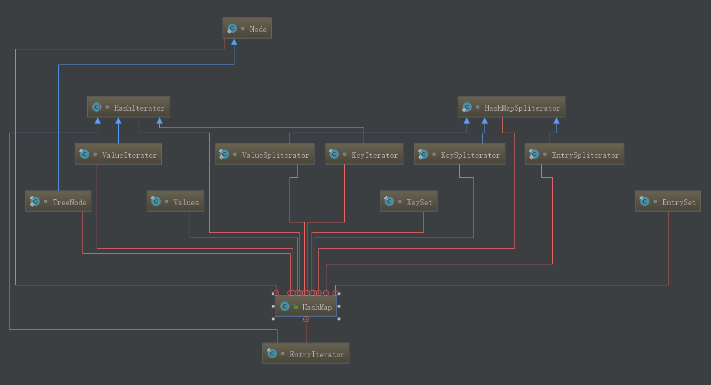

HashMap简介
类图如下:



HashMap 是一个散列表，它存储的内容是键值对(key-value)映射，该类继承于AbstractMap，实现了Map、Cloneable、java.io.Serializable接口。

HashMap 的实现不是同步的，这意味着它不是线程安全的。它的key、value都可以为null。此外，HashMap中的映射不是有序的。
 
HashMap有两个参数影响其性能：“初始容量” 和 “加载因子”。容量是哈希表中桶的数量，初始容量DEFAULT_INITIAL_CAPACITY  只是哈希表在创建时的容量。加载因子是哈希表在其容量自动增加之前可以达到多满的一种尺度。当哈希表中的条目数超出了加载因子与当前容量的乘积时，则要对该哈希表进行 rehash 操作（即重建内部数据结构），从而哈希表将具有大约两倍的桶数。

通常，默认加载因子DEFAULT_LOAD_FACTOR 是 0.75, 这是在时间和空间成本上寻求一种折衷。加载因子过高虽然减少了空间开销，但同时也增加了查询成本（在大多数 HashMap 类的操作中，包括 get 和 put 操作，都反映了这一点）。在设置初始容量时应该考虑到映射中所需的条目数及其加载因子，以便最大限度地减少 rehash 操作次数（提升性能）。如果初始容量大于最大条目数除以加载因子，则不会发生 rehash 操作。


注意新版本HashMap的变化

学习HashMap前一定要知道JDK1.8中他的实现和之前的JDK版本有了较大变化，在1.6的版本中，只使用数组+链表来实现HashMap，我们可以把数组看成一排桶连接起来，所以hash到同一个桶中的key，他们对应的结点是通过链表连接起来的。
JDK1.8的版本中，HashMap的底层实现是基于Node数组+链表+红黑树的，结点的key如果hash到同一个桶中，一开始先使用链表来连接，当一个桶中的结点超过阀值TREEIFY_THRESHOLD 时，该桶的结构会从链表转换成红黑树。当然这其中还设计到另外一个重要的参数MIN_TREEIFY_CAPACITY （默认为64），在加入结点初期时，同一个桶中的节点数可能会超过TREEIFY_THRESHOLD ，但是如果整个table的节点数不超过MIN_TREEIFY_CAPACITY ，该桶暂时不会向红黑树转化，而是对整个HashMap调用resize方法，把HashMap扩容2倍，然后把原来的table的结点转换到新的table上。


JDK1.6版本结构图。


HashMap中重要的成员变量
```java
static final int DEFAULT_INITIAL_CAPACITY = 1 << 4; // 默认初始大小16
static final float DEFAULT_LOAD_FACTOR = 0.75f; //默认负载因子0.75
static final int TREEIFY_THRESHOLD = 8; //链表转红黑树的阀值
static final int UNTREEIFY_THRESHOLD = 6; //红黑树转链表阀值
static final int MIN_TREEIFY_CAPACITY = 64; //容量超过64时才会用红黑树
```


HashMap的hash方法
```java
static final int hash(Object key) {
        int h;
        return (key == null) ? 0 : (h = key.hashCode()) ^ (h >>> 16);
    }
```

在这个方法中，可以看到如果key为null，都是hash到0位置，否则进行(h = key.hashCode()) ^ (h >>> 16)运算获取hashCode。所以HashMap是允许key为null的情况的。


HashMap的putVal方法
```java
public V put(K key, V value) {  //平常我们使用put方法来存放key和value
        return putVal(hash(key), key, value, false, true);
    }
final V putVal(int hash, K key, V value, boolean onlyIfAbsent,
                   boolean evict) {
        Node<K,V>[] tab; Node<K,V> p; int n, i;
        if ((tab = table) == null || (n = tab.length) == 0)
            n = (tab = resize()).length;  //如果table为null或者table大小为0，调用resize来初始化table
        if ((p = tab[i = (n - 1) & hash]) == null)  //hash到的桶还没有保存结点，直接保存到tab[i]中
            tab[i] = newNode(hash, key, value, null);
        else {
            Node<K,V> e; K k;
            if (p.hash == hash &&
                ((k = p.key) == key || (key != null && key.equals(k))))
                e = p;
            else if (p instanceof TreeNode)  //如果桶中第一个结点就是红黑树结点，那该桶是红黑树结构，新加入的结点就加入红黑树中
                e = ((TreeNode<K,V>)p).putTreeVal(this, tab, hash, key, value);
            else {
                for (int binCount = 0; ; ++binCount) {
                    if ((e = p.next) == null) { //链表末尾，所以p.next==null
                        p.next = newNode(hash, key, value, null); //把新增的结点链接到链表末尾，连接到链表后，下一步就是是否转红黑树判断
                        if (binCount >= TREEIFY_THRESHOLD - 1) // 如果同一个桶的节点数达到阀值，就可以把链表转为红黑树
                            treeifyBin(tab, hash);
                        break; //保存了结点就可以跳出for循环了
                    }
                    if (e.hash == hash &&
                        ((k = e.key) == key || (key != null && key.equals(k))))
                        break;
                    p = e;
                }
            }
            if (e != null) { // 如果说key已经存在，则更新value值，返回旧的value
                V oldValue = e.value;
                if (!onlyIfAbsent || oldValue == null)
                    e.value = value;
                afterNodeAccess(e);
                return oldValue;
            }
        }
        ++modCount;  //修改次数+1
        if (++size > threshold)  //判断是否超过resize的阀值
            resize(); //超过阀值要resize
        afterNodeInsertion(evict);
        return null;
    }
```


putVal方法可以总结如下：

    一，如果table为null或者table大小为0，调用resize来初始化table
    
    二，hash到的桶还没有保存结点，直接保存到tab[i]中
    
    三，如果桶中已经有结点，细分以下步骤
    
                ①判断该桶是否是红黑树结构，如果是则以红黑树的结点保存下来
                
                ②不是红黑树结构，先保存到链表中，然后检查链表的长度是否达到阀值，达到阀值则调用treeifyBin转化成红黑树，
                前面说过加入结点初期时，同一个桶中的节点数可能会超过TREEIFY_THRESHOLD ，但是
                如果整个table的节点数不超过MIN_TREEIFY_CAPACITY ，该桶暂时不会向红黑树转化，
                而是对整个HashMap调用resize方法，把HashMap扩容2倍，然后把原来的table的结点转换到新的table上。
    
    四，如果说key已经存在，则更新value值，返回旧的value
    
    五，判断table的大小是否已经超过resize阀值，如果是要进行resize操作。关于resize方法后面会解析。
    


HashMap的get方法
```java
public V get(Object key) {
        Node<K,V> e;
        return (e = getNode(hash(key), key)) == null ? null : e.value;
    }
```


可以看到真正起作用的是getNode方法。
```java
final Node<K,V> getNode(int hash, Object key) {
        Node<K,V>[] tab; Node<K,V> first, e; int n; K k;
        if ((tab = table) != null && (n = tab.length) > 0 &&
            (first = tab[(n - 1) & hash]) != null) {
            if (first.hash == hash && // always check first node
                ((k = first.key) == key || (key != null && key.equals(k))))
                return first;
            if ((e = first.next) != null) {
                if (first instanceof TreeNode) //如果桶是红黑树结构，则用红黑树的查找方式查找结点
                    return ((TreeNode<K,V>)first).getTreeNode(hash, key);
                do {  //用链表的方式查找结点
                    if (e.hash == hash &&
                        ((k = e.key) == key || (key != null && key.equals(k))))
                        return e;
                } while ((e = e.next) != null);
            }
        }
        return null; //结果可能为null
    }
```


getNode方法可以总结如下：

    一，获取hash值对应的桶，以及该桶的首节点first
                        二，如果first结点是红黑树结点，在红黑树中查找结点
                        三，如果first结点是链表结点，在链表中查找
                        四，返回结果值Node或null

HashMap的remove方法
```java
public V remove(Object key) {
        Node<K,V> e;
        return (e = removeNode(hash(key), key, null, false, true)) == null ?
            null : e.value;
    }

final Node<K,V> removeNode(int hash, Object key, Object value,
                               boolean matchValue, boolean movable) {
        Node<K,V>[] tab; Node<K,V> p; int n, index;
        if ((tab = table) != null && (n = tab.length) > 0 &&
            (p = tab[index = (n - 1) & hash]) != null) {
            Node<K,V> node = null, e; K k; V v;
            if (p.hash == hash &&
                ((k = p.key) == key || (key != null && key.equals(k))))
                node = p;  //先找到key所对应的桶，如果key所对应的结点就在首节点，那么把node指向首节点，即要删除的结点
            else if ((e = p.next) != null) { //key对应的结点不在首节点，查找后面的结点
                if (p instanceof TreeNode)  //如果首节点是红黑树结点，在红黑树中查找key对应的结点
                    node = ((TreeNode<K,V>)p).getTreeNode(hash, key);
                else { 
                    do {  //在链表中查找key对应的结点
                        if (e.hash == hash &&
                            ((k = e.key) == key ||
                             (key != null && key.equals(k)))) {
                            node = e;
                            break;
                        }
                        p = e;
                    } while ((e = e.next) != null);
                }
            }
            if (node != null && (!matchValue || (v = node.value) == value ||
                                 (value != null && value.equals(v)))) {
                if (node instanceof TreeNode) //如果是树节点，从红黑树中删除结点
                    ((TreeNode<K,V>)node).removeTreeNode(this, tab, movable);
                else if (node == p) //链表的情况，修改链表
                    tab[index] = node.next;
                else
                    p.next = node.next;
                ++modCount;
                --size;
                afterNodeRemoval(node);
                return node;
            }
        }
        return null;
    }
```


removeNode方法可以总结如下：

    一，先找到key所对应的桶，如果key所对应的结点就在首节点，那么把node指向首节点，
    
    二，如果key对应的结点不在桶的首节点，则该节点在链表或者红黑树中，如果桶的首节点是红黑树结点，
    在红黑树中查找key对应的结点，否则在链表中查找
    
    三，去红黑树或者链表中删除结点
    
    四，返回节点Node


HashMap的containsValue方法
```java
public boolean containsValue(Object value) {
        Node<K,V>[] tab; V v;
        if ((tab = table) != null && size > 0) {
            for (int i = 0; i < tab.length; ++i) {
                for (Node<K,V> e = tab[i]; e != null; e = e.next) {
                    if ((v = e.value) == value ||
                        (value != null && value.equals(v)))
                        return true;
                }
            }
        }
        return false;
    }
```

虽然该集合用了红黑树+链表，但是这个方法没有使用到红黑树，就是用很简单的for循环暴力搜索。


HashMap的resize方法
调用put方法时，如果发现目前的bucket占用程度已经超过了loadFactor，就会发生resize。简单的说就是把bucket扩充为2倍，之后重新计算index，把节点再放到新的bucket中。
方法的注释如下。

    /**
         * Initializes or doubles table size.  If null, allocates in
         * accord with initial capacity target held in field threshold.
         * Otherwise, because we are using power-of-two expansion, the
         * elements from each bin must either stay at same index, or move
         * with a power of two offset in the new table.
         *
         * @return the table
         */
当超过限制的时候会resize，又因为我们使用的是2次幂的扩展，所以，元素的位置要么是在原位置，要么是在原位置再移动2次幂的位置。


怎么理解呢？例如我们从16扩展为32时，具体的变化如下：

假设bucket大小n=2^k，元素在重新计算hash之后，因为n变为2倍,那么新的位置就是(2^(k+1)-1)&hash。而2^(k+1)-1=2^k+2^k-1，相当于2^k-1的mask范围在高位多1bit(红色)(再次提醒，原来的长度n也是2的次幂)，这1bit非1即0。如图：

所以，我们在resize的时候，不需要重新定位，只需要看看原来的hash值新增的那个bit是1还是0就好了，是0的话位置没变，是1的话位置变成“原位置+oldCap”。代码比较长就不贴了，下面为16扩充为32的resize示意图：

新增的1bit是0还是1可以认为是随机的，因此resize的过程均匀的把之前的冲突的节点分散到新的bucket中了。

HashMap线程不安全性
测试以下demo。
```java
public class HashMapInfiniteLoop {
    private static HashMap<Integer,String> map = new HashMap<Integer,String>(2,0.75f);
    public static void main(String[] args) {
        map.put(5,"C");
        new Thread("Thread1") {
            public void run() {
                map.put(7, "B");
                System.out.println(map);
            };
        }.start();
        new Thread("Thread2") {
            public void run() {
                map.put(3,"A");
                        System.out.println(map);
            };
        }.start();
    }
}
```

在JDK1.6环境下有可能出现下面的结果。
第一次执行结果：
{5=C, 3=A, 7=B}
{5=C, 3=A, 7=B}

第二次执行结果：
{5=C, 7=B}
{5=C, 3=A, 7=B}

第三次执行结果：
{5=C, 3=A}
{5=C, 7=B, 3=A}


在JDK1.8环境下均有可能出现下面的结果。
第一次执行结果：
{5=C, 7=B}
{5=C, 7=B, 3=A}

第二次执行结果：
{5=C, 7=B}
{5=C, 7=B}

第三次执行结果：
{5=C, 7=B, 3=A}
{5=C, 7=B, 3=A}

但是上面的这些结果只是表明HashMap是线程不安全的。关于JDK1.6下HashMap多线程造成死循环的问题还要另外分析。

多线程环境下HashMap如何形成死循环？

多线程环境下，在JDK1.7下操作HashMap可能会引起死循环，而在JDK1.8中同样的前提下不会引起死循环。
原因是扩容转移后前后链表顺序不变，保持之前节点的引用关系。
那么为什么HashMap依然是线程不安全的，通过源码看到put/get方法都没有加同步锁，
多线程情况最容易出现的就是：无法保证上一秒put的值，下一秒get的时候还是原值，
建议并发情况下使用ConcurrentHashMap。
