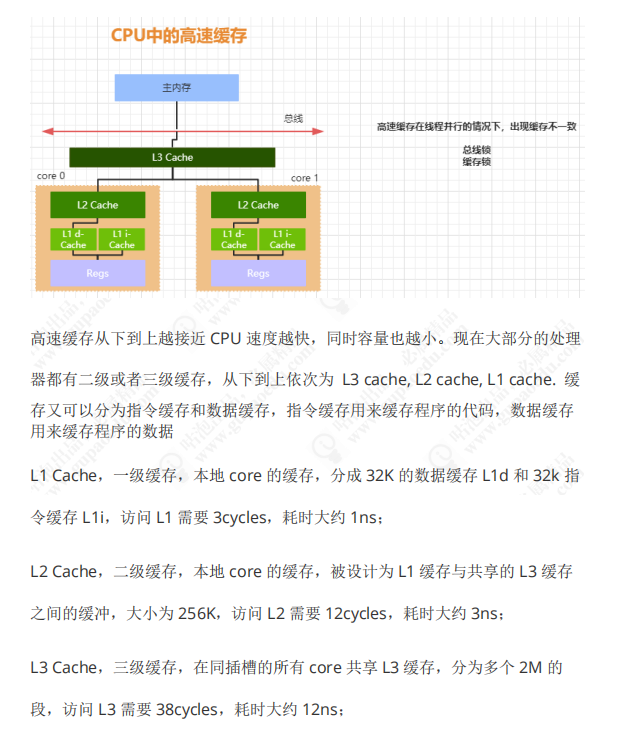
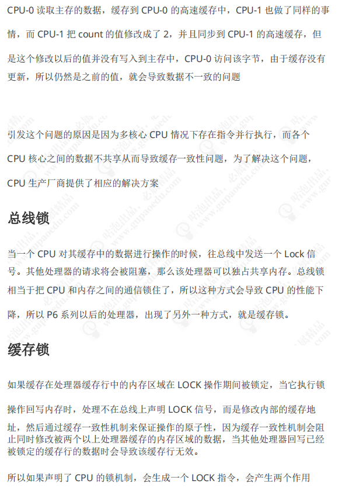
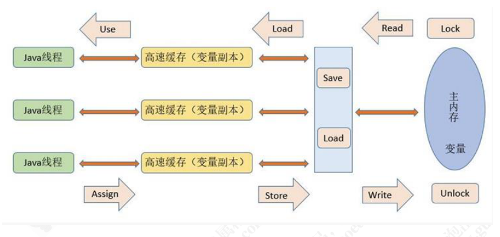

为什么要并发

1.充分利用CPU计算能力

　　随时多核处理器的发展，计算机的计算能力越来越强大。但是，由于磁盘读写、网络IO等这些通信、存储系统与CPU的速度相差多个数量级，我们在应用计算机时，如果单纯的让cpu等待磁盘IO、网络IO便是对cpu的计算能力的浪费。

　　那么如何让CPU的能力充分利用呢，我们自然会想到让多个任务同时执行，不必因为一个任务等待在IO上而让这个cpu也同时等待（占用），这时可以让这个cpu去处理别的任务

2.提升服务端的服务能力

　　我们除了充分利用CPU，在现实中，人们更希望一个服务能够良好的为多个客户端提供服务。作为服务端的工程师们，自然也会想到如何更好地并发处理多个任务了。通常衡量一个服务端并发能力的指标是TPS(transaction per second),

3.提升响应速度，提供更好地体验

　　当你在taobao上购买一个商品，你肯定愿意更快速的完成支付。在支付成功，会有生成订单、库存记录、邮件通知等等步骤，使用并发能够同时执行多个任务，事半功倍。

硬件层面优化

1.高速缓存

　　刚才说了，cpu的速度与存储等系统的速度差距巨大，但是使用cpu不可能避免去主内存读取数据，为了提高整体的计算能力，现代计算机在主存与CPU之间加入了高速缓存提高cpu整体的运算能力。当cpu做计算时，先将需要的数据存储在高速缓存上，cpu直接与高速缓存做交互，当cpu计算完时再将高速缓存的数据同步到主内存中，这样避免了多次与较慢的主内存通信，拖慢速度。

　　但是在多处理器计算机中，对每个cpu上加一层高速缓存的做法，也会引入更多的复杂性。如果多个cpu的高速缓存上存储了同一个变量，计算后，每个高速缓存的变量值不同，那么到底以谁的数据为准呢？

2.缓存一致性（Cache Coherence）

　　为了保证多个cpu的缓存与内存的同步有序可控，也就是为了解决缓存一致性问题，需要各个处理器访问缓存时遵守一些协议：如MESI等等。通过这些协议来保证缓存的一致性。

3.重排序优化

　　cpu还会对输入的指令进行乱序重排，以提高执行速度。这个乱序重排是针对每个计算单元内的指令（计算单元就是非原子性的执行指令），对于每个计算单元执行后的结果，会对着这些结果进行重组保证整体执行结果正确性。但是每个计算单元内部的顺序无法保证按序执行，如果一个计算单元依赖于另一个计算单元的中间状态，那么这样的乱序执行结果就无法保证正确。
除了cpu的重排序，JIT编译器也有类似的重排序优化。

JMM(java memory model)

　　JMM-java内存模型，就是通过定义一套抽象规则，去屏蔽底层操作系统、硬件对内存访问的差异，使得JAVA代码执行时对主存的访问效果是一致的。

　　JMM中定义的主存，类比于操作系统中的主存，主要存放线程间的共享数据（除去方法参数、局部变量）。
　　
　　JMM中的每个线程都有一个WorkingMemory，是主内存中部分数据的副本，只能该线程访问，类比于硬件的高速缓存。线程对数据的访问通常只能在workingMemory中进行，不能直接与主存交互。

WorkingMemory与Main Memory之间的交互

　　JMM定义了8种操作，来完成WorkingMemory与MainMemory之间的交互，这8中操作都是原子性的（对于64bit的long\double变量来说，某些平台的这8中操作并不是原子性的）。

    Lock： 作用于主内存MainMemory，锁住变量所在的MainMemory部分，不允许其他线程访问，排他访问。
    **unlock：**与lock对应，解锁。
    **read：**作用于主内存上，把主内存上的某个数据传输到workingMemory上，以便后续的load指令使用。
    load： 作用于workingMemory上，把从主内存传输的数据移动到workingMemory对应的变量副本上。
    **use ：**作用于workingMemroy，它把workingMemroy中的变量副本的值传递给java执行引擎。jvm每当执行到需要使用某个变量时都会执行这个操作。
    assign: 作用于workingMemory，把执行引擎中的某个值赋给workingMemory中的某个变量副本。JMV每当遇到一个赋值的字节码指令时，都会执行这个操作。
    store： 作用于workingMemory,把workingMemory中的某个变量值传输到主内存中，以便后续执行write操作。
    **write：**作用于主内存，把store操作传输过来的数据放入主内存中写入。

　　对于上述命令的执行，必须遵守的规则：

　　1.load、read 与 store、write 必须遵守先后顺序，但是它们之间可插入其他命令，也就是一个load（store）后边必须对应一个read（write）。如果要把一个变量从workingMemory中同步到主内存中，需要顺序的执行store、write。同样，要把一个变量从主内存同步到workingMemory中要顺序执行read、load。

　　2.不允许workingMemory中的数据在没有执行assign指令时，将数据同步到主内存中。
　　
　　3.一个新的变量必须要首先要在主存中出现，也就是说先要执行了assign、load之后才允许执行对这个变量的use、store指令。
　　
　　4.同一时刻只允许一个线程对变量执行lock操作，一个lock操作必须对应一个unlock操作
　　
　　5.对一个变量执行unlock之前，需要把这个变量同步回主存（执行 store、write操作）
　　
　　6.在执行lock时，会清空这个cpu对应的缓存数据，在执行引擎使用(use)这个数据之前，需要重新load或assign这个workingMemory中的缓存值。
　　
　　7.在执行unlock时，需要把这个变量同步回主存（store，write）。

原子性、可见性、有序性

　　前文说了，JMM对不同操作系统、硬件的屏蔽后，抽象出来的一套线程本地内存对主存访问的统一描述规则。具体主要围绕着可见性、原子性、有序性展开描述。

原子性：

　　JMM定义了 lock、read、load、use、assign、store、write、unlock原子性指令(long\doubel 64bit数据操作允许非原子性，但目前很少有非原子性实现的JVM)，来保证指令的原子性。在更大范围的计算中如何保证原子性？java中通过使用lock、unlock指令可以保证更大范围的原子性操作，在字节码层面对应monitorenter、monitorexit指令；在JDK中对应的就是synchronized关键字。

可见性：

　　synchronized：可见性通过 lock\unlock直接读取主内存刷新缓存来完成；
　　
　　volatile：可见性通过对volatile修饰的变量，直接立即从主存读取实现；
　　
　　final：通过插入屏障禁止重排序，保证每次读取final变量时获取已经初始化完成的值，并且final变量的引用无法更改。

有序性：

　　synchronized:通过使用lock\unlock 指令，限定一个线程独占访问，来实现有序性。
　　
　　volatile：通过使用内存屏障禁止重排序。
　　
　　final:同样是使用 内存屏障禁止重排序，保证一个线程观察另一个线程中的final变量总是初始化完成的。

　　1.Within-Thread As-If-Serial Semantics.

　　2.Without-Thread，reodrdering:指令重排序、工作内存与主内存同步延迟

　　volatile关键字本身就包含了禁止指令重排序的语义，而synchronized则是由“一个变量在同一个时刻只允许一条线程对其进行lock操作

happens-before

　　happens-before这个原则非常重要，它是判断数据是否存在竞争、 线程是否安全的主要依据，依靠这个原则，	如果说操作A先行发生于操作B，其实就是说在发生操作B之前，操作A产	生的影响能被操作B观察到，“影响”包括修改了内存中共享变量的值、 发送了消息、 调用了	方法等

　　下面是Java内存模型下一些“天然的”先行发生关系，这些先行发生关系无须任何同步器协助就已经存在，可以在编码中直接使用。

　　如果两个操作之间的关系不在此列，并且无法从下列规则推导出来的话，它们就没有顺序性保障，虚拟机可以对它们随意地进行重排序。

　　Program Order Rule：在一个线程内，按照程序代码顺序，书写在前面 的操作先行发生于书写在后面的操作(代码不存在依赖关系是可以被重排序的，但是从我们感知来说依旧是顺序执行的，as-if-serial)

　　Monitor Lock Rule：一个unlock操作先行发生于后面对同一个锁的lock操作。 这里必须强调的是同一个锁，而“后面”是指时间上的先后顺序.

　　Volatile Variable Rule：对一个volatile变量的写操作先行发生于后面对这个变量的读操作，这里的“后面”同样是指时间上的先后顺序。

　　Thread Start Rule：Thread对象的start（）方法先行发生于此线程的每一个动作。

　　Thread Termination Rule：线程中的所有操作都先行发生于对此线程的终止检测

　　Thread Interruption Rule：对线程interrupt（）方法的调用先行发生于被中断线程的代码检测到中断事件的发生

　　对象终结规则（Finalizer Rule）：一个对象的初始化完成（构造函数执行结束）先行发生于它的finalize（）方法的开始。

　　Transitivity：如果操作A先行发生于操作B，操作B先行发生于操作C，那就可以得出操作A先行发生于操作C的结论。

　　一个操作“时间上的先发生”不代表这个操作会是“先行发生”，一个操作“先行发生”也不能推导出这个操作必定是“时间上的先发生”。
也就是说happenbefore中的先行发生与我们常识中的时间先后的发生没有关系。这里的先行发生主要是对后续发生的操作产生影响！

线程的实现

　　线程是比进程更轻量级的调度执行单位，线程的引入，可以把一个进程的资
源分配和执行调度分开，各个线程既可以共享进程资源（内存地址、 文件I/O等），又可以
独立调度（线程是CPU调度的基本单位）。

　　主流的操作系统都提供了线程实现，Java语言则提供了在不同硬件和操作系统平台下对
线程操作的统一处理，每个已经执行start（）且还未结束的java.lang.Thread类的实例就代表
了一个线程。 我们注意到Thread类与大部分的Java API有显著的差别，它的所有关键方法都
是声明为Native的。 在Java API中，一个Native方法往往意味着这个方法没有使用或无法使用
平台无关的手段来实现（当然也可能是为了执行效率而使用Native方法，不过，通常最高效
率的手段也就是平台相关的手段）。 正因为如此，作者把本节的标题定为“线程的实现”而不
是“Java线程的实现”。

　　实现线程主要有3种方式：使用内核线程实现、 使用用户线程实现和使用用户线程加轻
量级进程混合实现。
