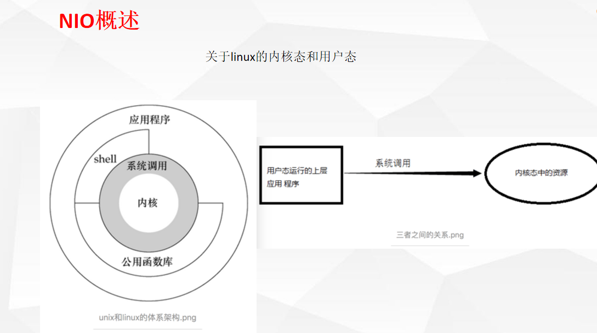
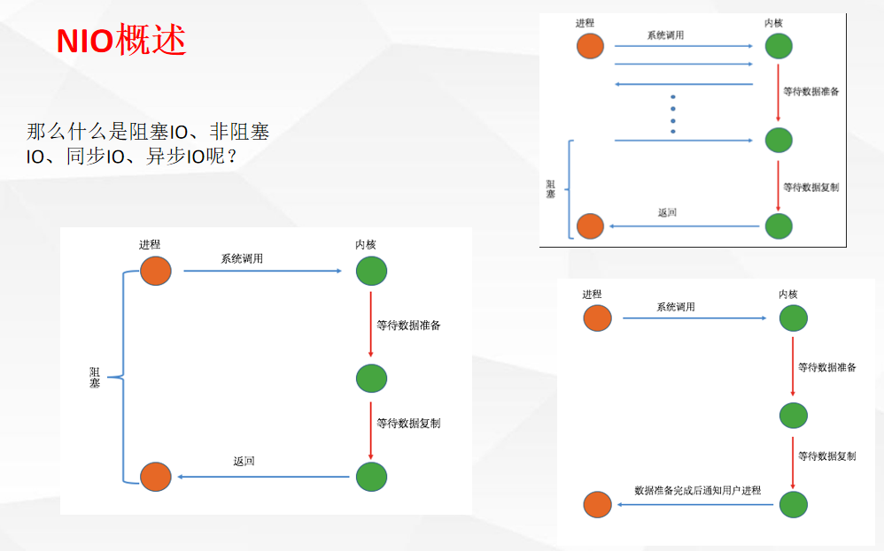
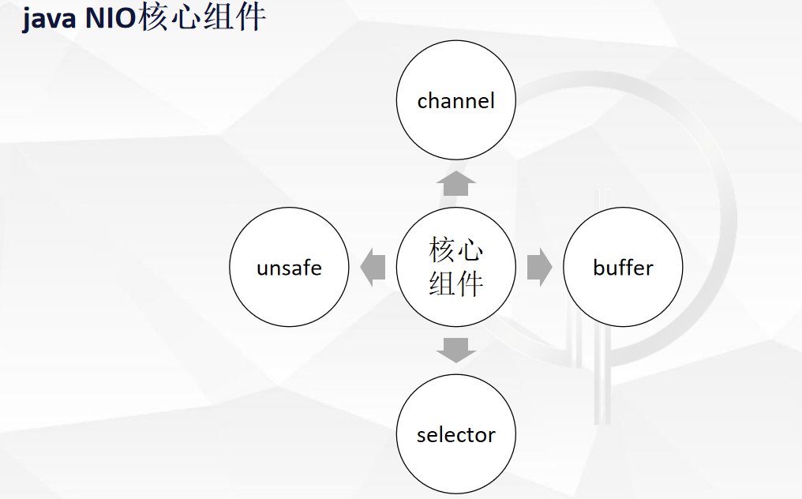

2、NIO 编程

　　JDK 1.4中的java.nio.*包中引入新的Java I/O库，其目的是提高速度。实际上，“旧”的I/O包已经使用NIO重新实现过，即使我们不显式的使用NIO编程，也能从中受益。速度的提高在文件I/O和网络I/O中都可能会发生，但本文只讨论后者。

2.1、简介

　　NIO我们一般认为是New I/O（也是官方的叫法），因为它是相对于老的I/O类库新增的（其实在JDK 1.4中就已经被引入了，但这个名词还会继续用很久，即使它们在现在看来已经是“旧”的了，所以也提示我们在命名时，需要好好考虑），做了很大的改变。但民间跟多人称之为Non-block I/O，即非阻塞I/O，因为这样叫，更能体现它的特点。而下文中的NIO，不是指整个新的I/O库，而是非阻塞I/O。



　　NIO提供了与传统BIO模型中的Socket和ServerSocket相对应的SocketChannel和ServerSocketChannel两种不同的套接字通道实现。

　　新增的着两种通道都支持阻塞和非阻塞两种模式。

 

　　阻塞模式使用就像传统中的支持一样，比较简单，但是性能和可靠性都不好；非阻塞模式正好与之相反。

　　对于低负载、低并发的应用程序，可以使用同步阻塞I/O来提升开发速率和更好的维护性；对于高负载、高并发的（网络）应用，应使用NIO的非阻塞模式来开发。


　　下面会先对基础知识进行介绍。



2.2、缓冲区 Buffer

　　Buffer是一个对象，包含一些要写入或者读出的数据。

　　在NIO库中，所有数据都是用缓冲区处理的。在读取数据时，它是直接读到缓冲区中的；在写入数据时，也是写入到缓冲区中。任何时候访问NIO中的数据，都是通过缓冲区进行操作。

　　缓冲区实际上是一个数组，并提供了对数据结构化访问以及维护读写位置等信息。

　　具体的缓存区有这些：ByteBuffe、CharBuffer、 ShortBuffer、IntBuffer、LongBuffer、FloatBuffer、DoubleBuffer。他们实现了相同的接口：Buffer。

　　Buffer有两种工作模式：写模式和读模式。在读模式下，应用程序只能从Buffer中读取数据，不能进行写操作。但是在写模式下，应用程序是可以进行读操作的，
这就表示可能会出现脏读的情况。所以一旦您决定要从Buffer中读取数据，一定要将Buffer的状态改为读模式。


2.3、通道 Channel

　　我们对数据的读取和写入要通过Channel，它就像水管一样，是一个通道。通道不同于流的地方就是通道是双向的，可以用于读、写和同时读写操作。

　　底层的操作系统的通道一般都是全双工的，所以全双工的Channel比流能更好的映射底层操作系统的API。

　　Channel主要分两大类：

    SelectableChannel：用户网络读写
    
    FileChannel：用于文件操作
    
　　后面代码会涉及的ServerSocketChannel和SocketChannel都是SelectableChannel的子类。ServerSocketChannel同时支持UDP协议和TCP协议，SocketChannel支持TCP协议，DatagramChannel支持UDP报文。


2.4、多路复用器 Selector

　　Selector是Java  NIO 编程的基础。

　　Selector提供选择已经就绪的任务的能力：Selector会不断轮询注册在其上的Channel，如果某个Channel上面发生读或者写事件，这个Channel就处于就绪状态，会被Selector轮询出来，然后通过SelectionKey可以获取就绪Channel的集合，进行后续的I/O操作。

　　一个Selector可以同时轮询多个Channel，因为JDK使用了epoll()代替传统的select实现，所以没有最大连接句柄1024/2048的限制。所以，只需要一个线程负责Selector的轮询，就可以接入成千上万的客户端。

　　应用程序将向Selector对象注册需要它关注的Channel，以及具体的某一个Channel会对哪些IO事件感兴趣。Selector中也会维护一个“已经注册的Channel”的容器。以下代码来自WindowsSelectorImpl实现类中，对已经注册的Channel的管理容器：

```java
// Initial capacity of the poll array

private final int INIT_CAP = 8;

// Maximum number of sockets for select().

// Should be INIT_CAP times a power of 2

private final static int MAX_SELECTABLE_FDS = 1024;

 
// The list of SelectableChannels serviced by this Selector. Every mod

// MAX_SELECTABLE_FDS entry is bogus, to align this array with the poll

// array, where the corresponding entry is occupied by the wakeupSocket

private SelectionKeyImpl[] channelArray = new SelectionKeyImpl[INIT_CAP];
```

　　多路复用IO技术是需要操作系统进行支持的，其特点就是操作系统可以同时扫描同一个端口上不同网络连接的时间。所以作为上层的JVM，必须要为不同操作系统的多路复用IO实现 编写不同的代码。Windows环境下对应的实现类是sun.nio.ch.WindowsSelectorImpl：

2.5、NIO服务端

　　代码比传统的Socket编程看起来要复杂不少。

　　直接贴代码吧，以注释的形式给出代码说明。

　　NIO创建的Server源码：

```java
public class NioServer {

    private static int DEFAULT_PORT = 12345;
    private static ServerHandle serverHandle;

    public static void start(){
        start(DEFAULT_PORT);
    }

    public static synchronized void start(int port){
        if(serverHandle!=null)
            serverHandle.stop();
        serverHandle = new ServerHandle(port);
        new Thread(serverHandle,"Server").start();
    }

    public static void main(String[] args){
        start();
    }

}
```

　　ServerHandle

```java
public class ServerHandle implements Runnable{

    private Selector selector;
    private ServerSocketChannel serverChannel;

    private volatile boolean started;
    /**
     * 构造方法
     * @param port 指定要监听的端口号
     */
    public ServerHandle(int port) {
        try{
            //创建选择器
            selector = Selector.open();

            //打开监听通道
            serverChannel = ServerSocketChannel.open();

            //如果为 true，则此通道将被置于阻塞模式；如果为 false，则此通道将被置于非阻塞模式
            //开启非阻塞模式
            serverChannel.configureBlocking(false);

            //绑定端口 backlog设为1024
            serverChannel.socket().bind(new InetSocketAddress(port),1024);

            //监听客户端连接请求
            serverChannel.register(selector, SelectionKey.OP_ACCEPT);

            //标记服务器已开启
            started = true;
            System.out.println("服务器已启动，端口号：" + port);
        }catch(IOException e){
            e.printStackTrace();
            System.exit(1);
        }
    }

    public void stop(){
        started = false;
    }

    @Override
    public void run() {

        //循环遍历selector
        while(started){
            try{

                //无论是否有读写事件发生，selector每隔1s被唤醒一次
                selector.select(1000);

                //阻塞,只有当至少一个注册的事件发生的时候才会继续.
                //	selector.select();
                Set<SelectionKey> keys = selector.selectedKeys();
                Iterator<SelectionKey> it = keys.iterator();
                SelectionKey key = null;
                while(it.hasNext()){
                    key = it.next();
                    it.remove();
                    try{
                        handleInput(key);
                    }catch(Exception e){
                        if(key != null){
                            key.cancel();
                            if(key.channel() != null){
                                key.channel().close();
                            }
                        }
                    }
                }
            }catch(Throwable t){
                t.printStackTrace();
            }
        }
        //selector关闭后会自动释放里面管理的资源
        if(selector != null)
            try{
                selector.close();
            }catch (Exception e) {
                e.printStackTrace();
            }
    }

    private void handleInput(SelectionKey key) throws IOException{
        if(key.isValid()){

            //处理新接入的请求消息
            if(key.isAcceptable()){
                ServerSocketChannel ssc = (ServerSocketChannel) key.channel();

                //通过ServerSocketChannel的accept创建SocketChannel实例
                //完成该操作意味着完成TCP三次握手，TCP物理链路正式建立
                SocketChannel sc = ssc.accept();

                //设置为非阻塞的
                sc.configureBlocking(false);

                //注册为读
                sc.register(selector, SelectionKey.OP_READ);
            }

            //读消息
            if(key.isReadable()){

                SocketChannel sc = (SocketChannel) key.channel();

                //创建ByteBuffer，并开辟一个1M的缓冲区
                ByteBuffer buffer = ByteBuffer.allocate(1024);

                //读取请求码流，返回读取到的字节数
                int readBytes = sc.read(buffer);

                //读取到字节，对字节进行编解码
                if(readBytes>0){

                //将缓冲区当前的limit设置为position=0，用于后续对缓冲区的读取操作
                    buffer.flip();

                    //根据缓冲区可读字节数创建字节数组
                    byte[] bytes = new byte[buffer.remaining()];

                    //将缓冲区可读字节数组复制到新建的数组中
                    buffer.get(bytes);
                    String expression = new String(bytes,"UTF-8");
                    System.out.println("服务器收到消息：" + expression);

                    //处理数据
                    String result = null;
                    try{
                        result = Calculator.cal(expression).toString();
                    }catch(Exception e){
                        result = "计算错误：" + e.getMessage();
                    }

                    //发送应答消息
                    doWrite(sc,result);
                }
                //没有读取到字节 忽略
                //	else if(readBytes==0);
                //链路已经关闭，释放资源
                else if(readBytes<0){
                    key.cancel();
                    sc.close();
                }
            }
        }
    }
    //异步发送应答消息
    private void doWrite(SocketChannel channel,String response) throws IOException{

        //将消息编码为字节数组
        byte[] bytes = response.getBytes();

        //根据数组容量创建ByteBuffer
        ByteBuffer writeBuffer = ByteBuffer.allocate(bytes.length);

        //将字节数组复制到缓冲区
        writeBuffer.put(bytes);

        //flip操作
        writeBuffer.flip();

        //发送缓冲区的字节数组
        channel.write(writeBuffer);

//****此处不含处理“写半包”的代码
    }
}
```
 可以看到，创建NIO服务端的主要步骤如下：

    打开ServerSocketChannel，监听客户端连接
    绑定监听端口，设置连接为非阻塞模式
    创建Reactor线程，创建多路复用器并启动线程
    将ServerSocketChannel注册到Reactor线程中的Selector上，监听ACCEPT事件
    Selector轮询准备就绪的key
    Selector监听到新的客户端接入，处理新的接入请求，完成TCP三次握手，简历物理链路
    设置客户端链路为非阻塞模式
    将新接入的客户端连接注册到Reactor线程的Selector上，监听读操作，读取客户端发送的网络消息
    异步读取客户端消息到缓冲区
    对Buffer编解码，处理半包消息，将解码成功的消息封装成Task
    将应答消息编码为Buffer，调用SocketChannel的write将消息异步发送给客户端
    
　　因为应答消息的发送，SocketChannel也是异步非阻塞的，所以不能保证一次能吧需要发送的数据发送完，此时就会出现写半包的问题。我们需要注册写操作，不断轮询Selector将没有发送完的消息发送完毕，然后通过Buffer的hasRemain()方法判断消息是否发送完成。

2.6、NIO客户端

　　还是直接上代码吧，过程也不需要太多解释了，跟服务端代码有点类似。

　　Client：

```java
public class NioClient {

    private static String DEFAULT_HOST = "127.0.0.1";
    private static int DEFAULT_PORT = 12345;
    private static ClientHandle clientHandle;
    public static void start(){
        start(DEFAULT_HOST,DEFAULT_PORT);
    }
    public static synchronized void start(String ip,int port){
        if(clientHandle!=null)
            clientHandle.stop();
        clientHandle = new ClientHandle(ip,port);
        new Thread(clientHandle,"Server").start();
    }
    //向服务器发送消息
    public static boolean sendMsg(String msg) throws Exception{
        if(msg.equals("q")) return false;
        clientHandle.sendMsg(msg);
        return true;
    }
    public static void main(String[] args){
        start();
    }
}
```

　　ClientHandle：

```java
public class ClientHandle implements Runnable{
    private String host;
    private int port;
    private Selector selector;
    private SocketChannel socketChannel;
    private volatile boolean started;
    public ClientHandle(String ip,int port) {
        this.host = ip;
        this.port = port;
        try{
//创建选择器
            selector = Selector.open();
//打开监听通道
            socketChannel = SocketChannel.open();
//如果为 true，则此通道将被置于阻塞模式；如果为 false，则此通道将被置于非阻塞模式
            socketChannel.configureBlocking(false);//开启非阻塞模式
            started = true;
        }catch(IOException e){
            e.printStackTrace();
            System.exit(1);
        }
    }
    public void stop(){
        started = false;
    }
    @Override
    public void run() {
        try{
            doConnect();
        }catch(IOException e){
            e.printStackTrace();
            System.exit(1);
        }
//循环遍历selector
        while(started){
            try{
//无论是否有读写事件发生，selector每隔1s被唤醒一次
                selector.select(1000);
//阻塞,只有当至少一个注册的事件发生的时候才会继续.
//	selector.select();
                Set<SelectionKey> keys = selector.selectedKeys();
                Iterator<SelectionKey> it = keys.iterator();
                SelectionKey key = null;
                while(it.hasNext()){
                    key = it.next();
                    it.remove();
                    try{
                        handleInput(key);
                    }catch(Exception e){
                        if(key != null){
                            key.cancel();
                            if(key.channel() != null){
                                key.channel().close();
                            }
                        }
                    }
                }
            }catch(Exception e){
                e.printStackTrace();
                System.exit(1);
            }
        }
//selector关闭后会自动释放里面管理的资源
        if(selector != null)
            try{
                selector.close();
            }catch (Exception e) {
                e.printStackTrace();
            }
    }
    private void handleInput(SelectionKey key) throws IOException{
        if(key.isValid()){
            SocketChannel sc = (SocketChannel) key.channel();
            if(key.isConnectable()){
                if(sc.finishConnect());
                else System.exit(1);
            }
//读消息
            if(key.isReadable()){
//创建ByteBuffer，并开辟一个1M的缓冲区
                ByteBuffer buffer = ByteBuffer.allocate(1024);
//读取请求码流，返回读取到的字节数
                int readBytes = sc.read(buffer);
//读取到字节，对字节进行编解码
                if(readBytes>0){
//将缓冲区当前的limit设置为position=0，用于后续对缓冲区的读取操作
                    buffer.flip();
//根据缓冲区可读字节数创建字节数组
                    byte[] bytes = new byte[buffer.remaining()];
//将缓冲区可读字节数组复制到新建的数组中
                    buffer.get(bytes);
                    String result = new String(bytes,"UTF-8");
                    System.out.println("客户端收到消息：" + result);
                }
//没有读取到字节 忽略
//	else if(readBytes==0);
//链路已经关闭，释放资源
                else if(readBytes<0){
                    key.cancel();
                    sc.close();
                }
            }
        }
    }
    //异步发送消息
    private void doWrite(SocketChannel channel,String request) throws IOException{
//将消息编码为字节数组
        byte[] bytes = request.getBytes();
//根据数组容量创建ByteBuffer
        ByteBuffer writeBuffer = ByteBuffer.allocate(bytes.length);
//将字节数组复制到缓冲区
        writeBuffer.put(bytes);
//flip操作
        writeBuffer.flip();
//发送缓冲区的字节数组
        channel.write(writeBuffer);
//****此处不含处理“写半包”的代码
    }
    private void doConnect() throws IOException{
        if(socketChannel.connect(new InetSocketAddress(host,port)));
        else socketChannel.register(selector, SelectionKey.OP_CONNECT);
    }
    public void sendMsg(String msg) throws Exception{
        socketChannel.register(selector, SelectionKey.OP_READ);
        doWrite(socketChannel, msg);
    }
}
```

2.7、演示结果

　　首先运行服务器，顺便也运行一个客户端：

```java
public class NioTest {

    //测试主方法
    public static void main(String[] args) throws Exception{
//运行服务器
       NioServer.start();
//避免客户端先于服务器启动前执行代码
        Thread.sleep(1000);
//运行客户端
        NioClient.start();
        while(NioClient.sendMsg(new Scanner(System.in).nextLine()));
    }
}
```

　　我们也可以单独运行客户端，效果都是一样的。

　　一次测试的结果：

    服务器已启动，端口号：12345
    
    1+2+3+4+5+6
    
    服务器收到消息：1+2+3+4+5+6
    
    客户端收到消息：21
    
    1*2/3-4+5*6/7-8
    
    服务器收到消息：1*2/3-4+5*6/7-8
    
    客户端收到消息：-7.0476190476190474
