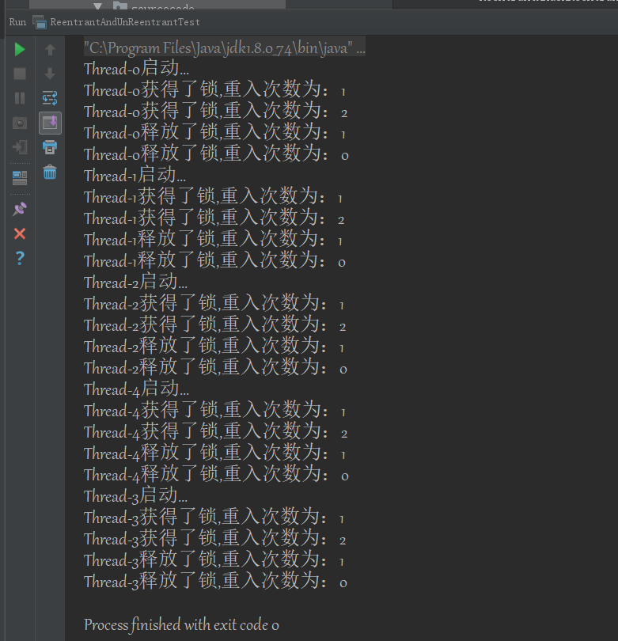
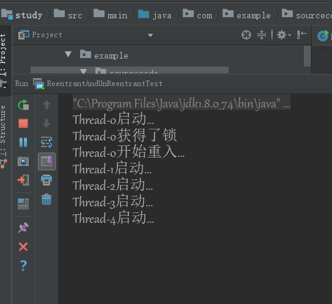
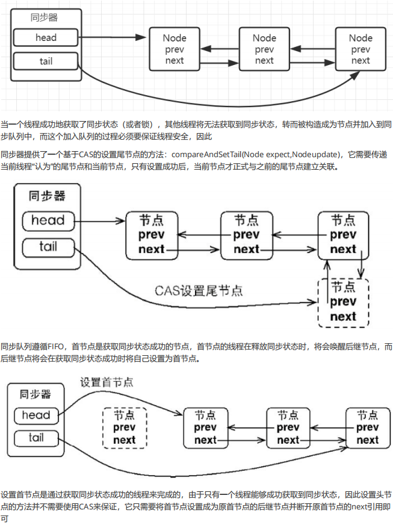
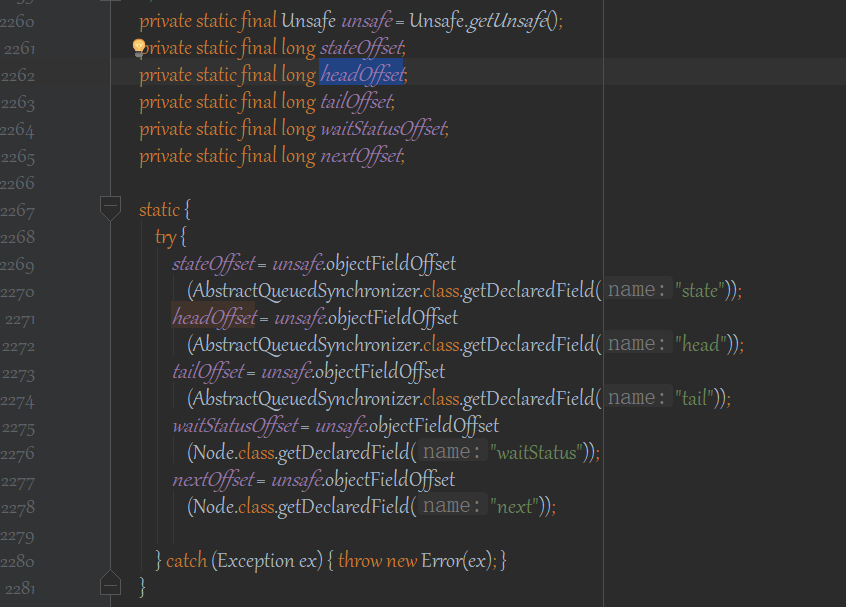
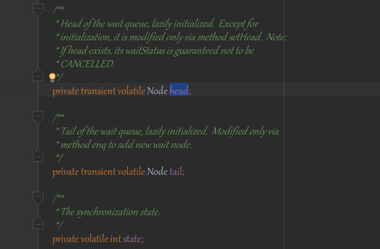
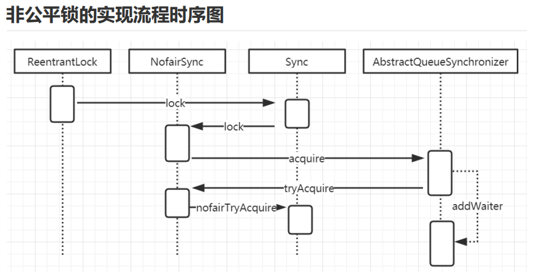
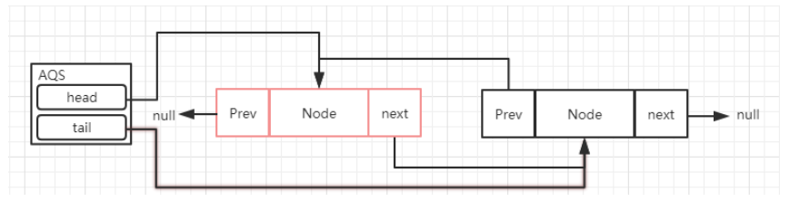
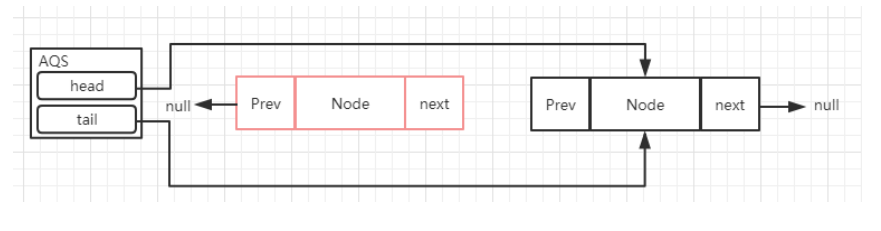

ReentrantLock

　　锁是用来控制多个线程访问共享资源的方式，一般来说，一个锁能够防止多个线程同时访问共享资源，
在Lock接口出现之前，Java应用程序只能依靠synchronized关键字来实现同步锁的功能，在java5以后，增加了JUC
的并发包且提供了Lock接口用来实现锁的功能，它提供了与synchroinzed关键字类似的同步功能，只是它比
synchronized更灵活，能够显示的获取和释放锁。

　　Lock是一个接口，核心的两个方法lock和unlock，它有很多的实现，比如ReentrantLock、ReentrantReadWriteLock;

　　ReentrantLock是一个可重入锁，笔者通过synchronize自己编写了一套可重入锁和非可重入锁

```java
/**
 * Create by  GF  in  16:52 2019/1/8
 * Description:不可重入锁
 * Modified  By:
 */
public class MyUnReentrantLock {

    private boolean isLocked = false;

    public synchronized void lock() throws InterruptedException {

        while (isLocked) {
            wait();
        }
        isLocked = true;
        System.out.println(Thread.currentThread().getName() +"获得了锁");
    }

    public synchronized void unlock() {
        System.out.println(Thread.currentThread().getName() +"释放了锁");
        isLocked = false;
        notify();
    }


    public Runnable getRunnable() {
        return () -> {
                System.out.println(Thread.currentThread().getName()+"启动...");
                    try {
                        lock();
                        System.out.println(Thread.currentThread().getName() + "开始重入...");
                        entrant();
                        System.out.println(Thread.currentThread().getName() + "重入成功...");
                    } catch (InterruptedException e) {
                        e.printStackTrace();
                    }
                        unlock();
            };
    }

    private  void entrant() {
        try {
            lock();
        } catch (InterruptedException e) {
            e.printStackTrace();
        }
        unlock();
    }


}
```

```java
public class MyReentrantLock {

    private boolean isLocked = false;
    Thread lockedBy = null;
    int lockedCount = 0;

    public synchronized void lock() throws InterruptedException {
        Thread thread = Thread.currentThread();
        while (isLocked && lockedBy != thread) {
            wait();
        }
        isLocked = true;
        lockedCount ++;
        lockedBy = thread;
        System.out.println(thread.getName() + "获得了锁,重入次数为：" + lockedCount);
    }

    public synchronized void unlock() {
        Thread thread = Thread.currentThread();
        if (thread== this.lockedBy) {
            lockedCount --;
            System.out.println(thread.getName() + "释放了锁,重入次数为：" + lockedCount);
            if (lockedCount == 0) {
                isLocked = false;
                notify();
            }
        }
    }


    protected Runnable getRunnable() {
        return () -> {
            System.out.println(Thread.currentThread().getName() + "启动...");
            try {
                lock();
                entrant();
            } catch (InterruptedException e) {
                e.printStackTrace();
            }
            unlock();

        };
    }

    private void entrant() {
        try {
            lock();
        } catch (InterruptedException e) {
            e.printStackTrace();
        }
        unlock();
    }

}
```

测试结果如下：

```java
public class ReentrantAndUnReentrantTest {


      public static void main(String[] args) {

        MyUnReentrantLock unReentrantLock = new MyUnReentrantLock();
         MyReentrantLock reentrantLock = new MyReentrantLock();
         Thread[] threadArray = new Thread[10];
         for (int i = 0; i < (threadArray.length >> 1); i++) {
             threadArray[i] = new Thread(reentrantLock.getRunnable());
             threadArray[i].start();
         }
         for (int i = 9; i > 4; i --) {
             threadArray[i] = new Thread(unReentrantLock.getRunnable());
             threadArray[i].start();
         }
     }

}
```






ReentrantReadWriteLock

　　我们以前理解的锁，基本都是排他锁，也就是这些锁在同一时刻只允许一个线程进行访问，而读写所在同一时刻可
以允许多个线程访问，但是在写线程访问时，所有的读线程和其他写线程都会被阻塞。读写锁维护了一对锁，一个
读锁、一个写锁; 一般情况下，读写锁的性能都会比排它锁好，因为大多数场景读是多于写的。在读多于写的情况
下，读写锁能够提供比排它锁更好的并发性和吞吐量
    
    读锁与读锁可以共享
    读锁与写锁不可以共享（排他）
    写锁与写锁不可以共享（排他）
    
    
Lock和synchronized的简单对比

　　通过我们对Lock的使用以及对synchronized的了解，基本上可以对比出这两种锁的区别了。因为这个也是在面试
过程中比较常见的问题

　　从层次上，一个是关键字、一个是类， 这是最直观的差异

　　从使用上，lock具备更大的灵活性，可以控制锁的释放和获取； 而synchronized的锁的释放是被动的，当出现
异常或者同步代码块执行完以后，才会释放锁

　　lock可以判断锁的状态、而synchronized无法做到

　　lock可以实现公平锁、非公平锁； 而synchronized只有非公平锁


AQS

　　Lock之所以能实现线程安全的锁，主要的核心是
AQS(AbstractQueuedSynchronizer),AbstractQueuedSynchronizer提供了一个FIFO队列，可以看做是一个用来实
现锁以及其他需要同步功能的框架。这里简称该类为AQS。AQS的使用依靠继承来完成，子类通过继承自AQS并实
现所需的方法来管理同步状态。例如常见的ReentrantLock，CountDownLatch等AQS的两种功能

　　从使用上来说，AQS的功能可以分为两种：独占和共享。

　　独占锁模式下，每次只能有一个线程持有锁，比如前面给大家演示的ReentrantLock就是以独占方式实现的互斥锁

　　共享锁模式下，允许多个线程同时获取锁，并发访问共享资源，比如ReentrantReadWriteLock。

　　很显然，独占锁是一种悲观保守的加锁策略，它限制了读/读冲突，如果某个只读线程获取锁，则其他读线程都只
能等待，这种情况下就限制了不必要的并发性，因为读操作并不会影响数据的一致性。共享锁则是一种乐观锁，它
放宽了加锁策略，允许多个执行读操作的线程同时访问共享资源


AQS的内部实现

　　同步器依赖内部的同步队列（一个FIFO双向队列）来完成同步状态的管理，当前线程获取同步状态失败时，同步器
会将当前线程以及等待状态等信息构造成为一个节点（Node）并将其加入同步队列，同时会阻塞当前线程，当同
步状态释放时，会把首节点中的线程唤醒，使其再次尝试获取同步状态。

Node的主要属性如下
```java
static final class Node {
    int waitStatus; //表示节点的状态，包含cancelled（取消）；condition 表示节点在等待condition也就是在condition队列中
    Node prev; //前继节点
    Node next; //后继节点
    Node nextWaiter; //存储在condition队列中的后继节点
    Thread thread; //当前线程
}
```
　　AQS类底层的数据结构是使用双向链表，是队列的一种实现。包括一个head节点和一个tail节点，分别表示头结点
和尾节点，其中头结点不存储Thread，仅保存next结点的引用



compareAndSet

　　AQS中，除了本身的链表结构以外，还有一个很关键的功能，就是CAS，这个是保证在多线程并发的情况下保证线
程安全的前提下去把线程加入到AQS中的方法,可以简单理解为乐观锁

```java
private final boolean compareAndSetHead(Node update) {
    return unsafe.compareAndSwapObject(this, headOffset, null, update);
}
```
　　这个方法里面，首先，用到了unsafe类，(Unsafe类是在sun.misc包下，不属于Java标准。但是很多Java的基础类库，包括一些被
广泛使用的高性能开发库都是基于Unsafe类开发的，比如Netty、Hadoop、Kafka等；Unsafe可认为是Java中留
下的后门，提供了一些低层次操作，如直接内存访问、线程调度等)
然后调用了compareAndSwapObject这个方法
```java
public final native boolean compareAndSwapObject(Object var1, long var2, Object var4, Object var5);
```

　　这个是一个native方法，第一个参数为需要改变的对象，第二个为偏移量(即之前求出来的headOffset的值)，第三个参数为期待的值，第四
个为更新后的值

　　整个方法的作用是如果当前时刻的值等于预期值var4相等，则更新为新的期望值 var5，如果更新成功，则返回
true，否则返回false；

　　这里传入了一个headOffset，这个headOffset是什么呢？在下面的代码中，通过unsafe.objectFieldOffset

　　

　　然后通过反射获取了AQS类中的成员变量，并且这个成员变量被volatile修饰的



unsafe.objectFieldOffset

　　headOffset这个是指类中相应字段在该类的偏移量，在这里具体即是指head这个字段在AQS类的内存中相对于该
类首地址的偏移量。

　　一个Java对象可以看成是一段内存，每个字段都得按照一定的顺序放在这段内存里，通过这个方法可以准确地告诉
你某个字段相对于对象的起始内存地址的字节偏移。用于在后面的compareAndSwapObject中，去根据偏移量找
到对象在内存中的具体位置

　　这个方法在unsafe.cpp文件中，代码如下


　　所以其实compareAndSet这个方法，最终调用的是unsafe类的compareAndSwap，这个指令会对内存中的共享数
据做原子的读写操作。

　　1. 首先， cpu会把内存中将要被更改的数据与期望值做比较

　　2. 然后，当两个值相等时，cpu才会将内存中的对象替换为新的值。否则，不做变更操作

　　3. 最后，返回操作执行结果

很显然，这是一种乐观锁的实现思路。

ReentrantLock的实现原理分析

　　之所以叫重入锁是因为同一个线程如果已经获得了锁，那么后续该线程调用lock方法时不需要再次获取锁，也就是
不会阻塞；重入锁提供了两种实现，一种是非公平的重入锁，另一种是公平的重入锁。怎么理解公平和非公平呢？

　　如果在绝对时间上，先对锁进行获取的请求一定先被满足获得锁，那么这个锁就是公平锁，反之，就是不公平的。
简单来说公平锁就是等待时间最长的线程最优先获取锁。




源码分析

ReentrantLock.lock
```java
public void lock() {
    sync.lock();
}
```
　　这个是获取锁的入口，调用了sync.lock； sync是一个实现了AQS的抽象类，这个类的主要作用是用来实现同步控
制的，并且sync有两个实现，一个是NonfairSync(非公平锁)、另一个是FailSync(公平锁)； 我们先来分析一下非公
平锁的实现

NonfairSync.lock
```java
        final void lock() {
            //这是跟公平锁的主要区别,一上来就试探锁是否空闲,如果可以插队，则设置获得锁的线程为当前线程
            if (compareAndSetState(0, 1))
                //exclusiveOwnerThread属性是AQS从父类AbstractOwnableSynchronizer中继承的属性，用来保存当前占用同步状态的线程
                setExclusiveOwnerThread(Thread.currentThread());
            else
                //尝试去获取锁
                acquire(1);
        }
```
　　compareAndSetState，这个方法通过cas算法去改变state的值，而这个state
是什么呢？ 在AQS中存在一个变量state，对于ReentrantLock来说，如果state=0表示无锁状态、如果state>0表示
有锁状态。

　　所以在这里，是表示当前的state如果等于0，则替换为1，如果替换成功表示获取锁成功了
由于ReentrantLock是可重入锁，所以持有锁的线程可以多次加锁，经过判断加锁线程就是当前持有锁的线程时（即
exclusiveOwnerThread==Thread.currentThread()），即可加锁，每次加锁都会将state的值+1，state等于几，
就代表当前持有锁的线程加了几次锁;

　　解锁时每解一次锁就会将state减1，state减到0后，锁就被释放掉，这时其它线程可以加锁；

AbstractQueuedSynchronizer.acquire

　　如果CAS操作未能成功，说明state已经不为0，此时继续acquire(1)操作,acquire是AQS中的方法 当多个线程同时进
入这个方法时，首先通过cas去修改state的状态，如果修改成功表示竞争锁成功，竞争失败的，tryAcquire会返回
false
```java
  public final void acquire(int arg) {
        if (!tryAcquire(arg) &&
            acquireQueued(addWaiter(Node.EXCLUSIVE), arg))
            selfInterrupt();
    }
```
这个方法的主要作用是

Ø 尝试获取独占锁，获取成功则返回，否则

Ø 自旋获取锁，并且判断中断标识，如果中断标识为true，则设置线程中断

Ø addWaiter方法把当前线程封装成Node，并添加到队列的尾部

NonfairSync.tryAcquire

　　tryAcquire方法尝试获取锁，如果成功就返回，如果不成功，则把当前线程和等待状态信息构适成一个Node节
点，并将结点放入同步队列的尾部。然后为同步队列中的当前节点循环等待获取锁，直到成功
```java
protected final boolean tryAcquire(int acquires) {
    return nonfairTryAcquire(acquires);
}
```

nofairTryAcquire

　　这里可以看非公平锁的涵义，即获取锁并不会严格根据争用锁的先后顺序决定。这里的实现逻辑类似synchroized
关键字的偏向锁的做法，即可重入而不用进一步进行锁的竞争，也解释了ReentrantLock中Reentrant的意义
```java
      final boolean nonfairTryAcquire(int acquires) {
            final Thread current = Thread.currentThread();
            //获取当前的状态，前面讲过，默认情况下是0表示无锁状态
            int c = getState();
            if (c == 0) {
                if (compareAndSetState(0, acquires)) {
                    //通过cas来改变state状态的值，如果更新成功，表示获取锁成功, 这个操作外部方法lock()就做过一次，
                    // 这里再做只是为了再尝试一次，尽量以最简单的方式获取锁
                    setExclusiveOwnerThread(current);
                    return true;
                }
            }
            //如果当前线程等于获取锁的线程，表示重入，直接累加重入次数
            else if (current == getExclusiveOwnerThread()) {
                int nextc = c + acquires;
                if (nextc < 0) // overflow 如果这个状态值越界，抛出异常；如果没有越界，则设置后返回true
                    throw new Error("Maximum lock count exceeded");
                setState(nextc);
                return true;
            }
            //如果状态不为0，且当前线程不是owner，则返回false。
            return false;//获取锁失败，返回false
        }
```

addWaiter

　　当前锁如果已经被其他线程锁持有，那么当前线程来去请求锁的时候，会进入这个方法,这个方法主要是把当前线程
封装成node，添加到AQS的链表中
```java
    private Node addWaiter(Node mode) {
        //创建一个独占的Node节点,mode为排他模式
        Node node = new Node(Thread.currentThread(), mode);
        // Try the fast path of enq; backup to full enq on failure
        // 尝试快速入队,如果失败则降级至full enq
        // tail是AQS的中表示同步队列队尾的属性，刚开始为null，所以进行enq(node)方法
        Node pred = tail;
        if (pred != null) {
            node.prev = pred;
            if (compareAndSetTail(pred, node)) {
                // 如果成功之后旧的tail的next指针再指向新的tail,成为双向链表
                pred.next = node;
                return node;
            }
        }
        // 如果队列为null或者CAS设置新的tail失败
        enq(node);
        return node;
    }
```

enq
　　enq就是通过自旋操作把当前节点加入到队列中
```java
private Node enq(final Node node) {
        //无效的循环，为什么采用for(;;)，是因为它执行的指令少，不占用寄存器
        for (;;) {
            // 此时head, tail都为null
            Node t = tail;
            // 如果tail为null则说明队列首次使用,需要进行初始化
            if (t == null) { // Must initialize
                // 设置头节点,如果失败则存在竞争,留至下一轮循环
                if (compareAndSetHead(new Node()))
                    // 用CAS的方式创建一个空的Node作为头结点，因为此时队列中只一个头结 点，
                    // 所以tail也指向head，第一次循环执行结束
                    tail = head;
            } else {
                //进行第二次循环时，tail不为null，进入else区域。将当前线程的Node结点的prev指向tail，然后使用CAS将tail指向Node
                //这部分代码和addWaiter代码一样，将当前节点添加到队列
                node.prev = t;
                if (compareAndSetTail(t, node)) {
                    //t此时指向tail,所以可以CAS成功，将tail重新指向CNode。此时t为更新前的tail的值，
                    // 即指向空的头结点，t.next=node，就将头结点的后续结点指向Node，返回头结点
                    t.next = node;
                    return t;
                }
            }
        }
    }
```
代码运行到这里，aqs队列的结构就是这样一个表现



acquireQueued

　　addWaiter返回了插入的节点，作为acquireQueued方法的入参,这个方法主要用于争抢锁

```java
final boolean acquireQueued(final Node node, long arg) {
        boolean failed = true;
        try {
            boolean interrupted = false;
            for (;;) {
                // 获取prev节点,若为null即刻抛出NullPointException
                final Node p = node.predecessor();
                // 如果前驱为head才有资格进行锁的抢夺
                if (p == head && tryAcquire(arg)) {
                    // 获取锁成功后就不需要再进行同步操作了,获取锁成功的线程作为新的head节点
                    setHead(node);
                    //凡是head节点,head.thread与head.prev永远为null, 但是head.next不为nu
                    p.next = null; // help GC
                    //获取锁成功
                    failed = false;
                    return interrupted;
                }
                //如果获取锁失败，则根据节点的waitStatus决定是否需要挂起线程
                if (shouldParkAfterFailedAcquire(p, node) &&
                    parkAndCheckInterrupt())
                    // 若前面为true,则执行挂起,待下次唤醒的时候检测中断的标 志
                    interrupted = true;
            }
        } finally {
            // 如果抛出异常则取消锁的获取,进行出队(sync queue)操作
            if (failed)
                cancelAcquire(node);
        }
    }
```
　　原来的head节点释放锁以后，会从队列中移除，原来head节点的next节点会成为head节点




shouldParkAfterFailedAcquire

　　从上面的分析可以看出，只有队列的第二个节点可以有机会争用锁，如果成功获取锁，则此节点晋升为头节点。对
于第三个及以后的节点，if (p == head)条件不成立，首先进行shouldParkAfterFailedAcquire(p, node)操作

　　shouldParkAfterFailedAcquire方法是判断一个争用锁的线程是否应该被阻塞。它首先判断一个节点的前置节点的状态是否为Node.SIGNAL，如果
是，是说明此节点已经将状态设置-如果锁释放，则应当通知它，所以它可以安全的阻塞了，返回true

```java
 private static boolean shouldParkAfterFailedAcquire(Node pred, Node node) {
        //前继节点的状态
        int ws = pred.waitStatus;
        //如果是SIGNAL状态，意味着当前线程需要被unpark唤醒
        if (ws == Node.SIGNAL)
            /*
             * This node has already set status asking a release
             * to signal it, so it can safely park.
             */
        /**
         * 如果前节点的状态大于0，即为CANCELLED状态时，则会从前节点开始逐步循环找到一个
         * 没有被“CANCELLED”节点设置为当前节点的前节点，返回false。在下次循环执行shouldParkAfterFailedAcquire时，
         * 返回true。这个操作实际是把队列中CANCELLED的节点剔除掉
         */
            return true;
        // 如果前继节点是“取消”状态，则设置 “当前节点”的 “当前前继节点” 为 “‘原前继节点'的前继节点
        if (ws > 0) {
            /*
             * Predecessor was cancelled. Skip over predecessors and
             * indicate retry.
             */
            do {
                node.prev = pred = pred.prev;
            } while (pred.waitStatus > 0);
            pred.next = node;
        } else {
            /*
             * waitStatus must be 0 or PROPAGATE.  Indicate that we
             * need a signal, but don't park yet.  Caller will need to
             * retry to make sure it cannot acquire before parking.
             */
            // 如果前继节点为“0”或者“共享锁”状态，则设置前继节点为SIGNAL状态。
            compareAndSetWaitStatus(pred, ws, Node.SIGNAL);
        }
        return false;
    }
```

　　假如有t1,t2两个线程都加入到了链表中，如果head节点位置的线程一直持有锁，那么t1和t2就是挂起状态，而HEAD以及Thread1的的awaitStatus都是
SIGNAL，在多次尝试获取锁失败以后，就会通过下面的方法进行挂起（这个地方就是避免了惊群效应，每个节点
只需要关心上一个节点的状态即可）

　　SIGNAL：值为-1，表示当前节点的的后继节点将要或者已经被阻塞，在当前节点释放的时候需要unpark后继节点；

　　CONDITION：值为-2，表示当前节点在等待condition，即在condition队列中；

　　PROPAGATE：值为-3，表示releaseShared需要被传播给后续节点（仅在共享模式下使用）；


parkAndCheckInterrupt

　　如果shouldParkAfterFailedAcquire返回了true，则会执行：“parkAndCheckInterrupt()”方法，它是通过
LockSupport.park(this)将当前线程挂起到WATING状态，它需要等待一个中断、unpark方法来唤醒它，通过这样
一种FIFO的机制的等待，来实现了Lock的操作

```java
    private final boolean parkAndCheckInterrupt() {
        // LockSupport提供park()和unpark()方法实现阻塞线程和解除线程阻塞
        LockSupport.park(this);
        return Thread.interrupted();
    }
```

ReentrantLock.unlock

　　加锁的过程分析完以后，再来分析一下释放锁的过程，调用release方法，这个方法里面做两件事，1，释放锁 ；2，唤醒park的线程

```java
public final boolean release(long arg) {
        if (tryRelease(arg)) {
            Node h = head;
            if (h != null && h.waitStatus != 0)
                unparkSuccessor(h);
            return true;
        }
        return false;
    }
```
tryRelease

　　这个动作可以认为就是一个设置锁状态的操作，而且是将状态减掉传入的参数值（参数是1），如果结果状态为0，
就将排它锁的Owner设置为null，以使得其它的线程有机会进行执行。 在排它锁中，加锁的时候状态会增加1（当
然可以自己修改这个值），在解锁的时候减掉1，同一个锁，在可以重入后，可能会被叠加为2、3、4这些值，只
有unlock()的次数与lock()的次数对应才会将Owner线程设置为空，而且也只有这种情况下才会返回true。

```java
protected final boolean tryRelease(int releases) {
    int c = getState() - releases; // 这里是将锁的数量减1
    if (Thread.currentThread() != getExclusiveOwnerThread())// 如果释放的线程和获取锁的线程不是同一个，抛出非法监视器状态异常throw new IllegalMonitorStateException();
         boolean free = false;
         if (c == 0) {
             // 由于重入的关系，不是每次释放锁c都等于0，
             // 直到最后一次释放锁时，才会把当前线程释放
             free = true;
             setExclusiveOwnerThread(null);
         }
         setState(c);
    return free;
}
```

LockSupport

　　LockSupport类是Java6引入的一个类，提供了基本的线程同步原语。LockSupport实际上是调用了Unsafe类里的
函数，归结到Unsafe里，只有两个函数：
```java
    public native void unpark(Thread jthread);
    public native void park(boolean isAbsolute, long time);
```
　　unpark函数为线程提供“许可(permit)”，线程调用park函数则等待“许可”。这个有点像信号量，但是这个“许可”是不
能叠加的，“许可”是一次性的。

　　permit相当于0/1的开关，默认是0，调用一次unpark就加1变成了1.调用一次park会消费permit，又会变成0。 如
果再调用一次park会阻塞，因为permit已经是0了。直到permit变成1.这时调用unpark会把permit设置为1.每个线
程都有一个相关的permit，permit最多只有一个，重复调用unpark不会累积

　　在使用LockSupport之前，我们对线程做同步，只能使用wait和notify，但是wait和notify其实不是很灵活，并且耦
合性很高，调用notify必须要确保某个线程处于wait状态，而park/unpark模型真正解耦了线程之间的同步，先后
顺序没有没有直接关联，同时线程之间不再需要一个Object或者其它变量来存储状态，不再需要关心对方的状态。

总结

　　分析了独占式同步状态获取和释放过程后，做个简单的总结：在获取同步状态时，同步器维护一个同步队列，获取
状态失败的线程都会被加入到队列中并在队列中进行自旋；移出队列（或停止自旋）的条件是前驱节点为头节点且
成功获取了同步状态。在释放同步状态时，同步器调用tryRelease(int arg)方法释放同步状态，然后唤醒头节点的
后继节点。

公平锁和非公平锁的区别

　　锁的公平性是相对于获取锁的顺序而言的，如果是一个公平锁，那么锁的获取顺序就应该符合请求的绝对时间顺
序，也就是FIFO。 在上面分析的例子来说，只要CAS设置同步状态成功，则表示当前线程获取了锁，而公平锁则不
一样，差异点有两个

FairSync.tryAcquire
```java
final void** lock() {
    acquire(1);
}
```
　　非公平锁在获取锁的时候，会先通过CAS进行抢占，而公平锁则不会

FairSync.tryAcquire
```java
protected final boolean tryAcquire(int acquires) {
            final Thread current = Thread.currentThread();
            int c = getState();
            if (c == 0) {
                if (!hasQueuedPredecessors() &&
                    compareAndSetState(0, acquires)) {
                    setExclusiveOwnerThread(current);
                    return true;
                }
            }
            else if (current == getExclusiveOwnerThread()) {
                int nextc = c + acquires;
                if (nextc < 0)
                    throw new Error("Maximum lock count exceeded");
                setState(nextc);
                return true;
            }
            return false;
        }
```

　　这个方法与nonfairTryAcquire(int acquires)比较，不同的地方在于判断条件多了hasQueuedPredecessors()方
法，也就是加入了[同步队列中当前节点是否有前驱节点]的判断，如果该方法返回true，则表示有线程比当前线程
更早地请求获取锁，因此需要等待前驱线程获取并释放锁之后才能继续获取锁


