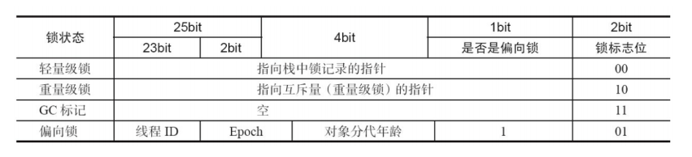
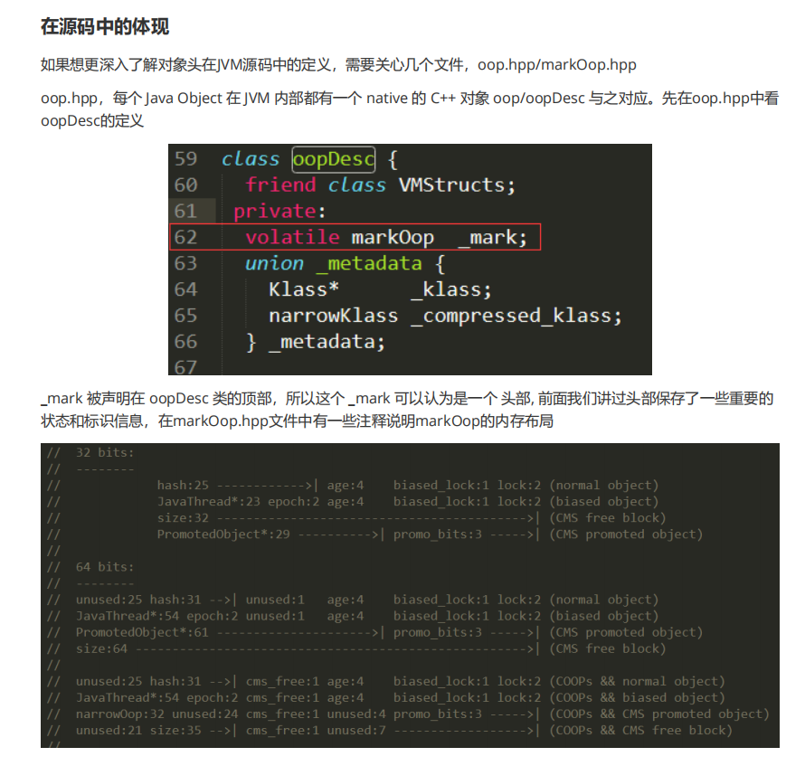
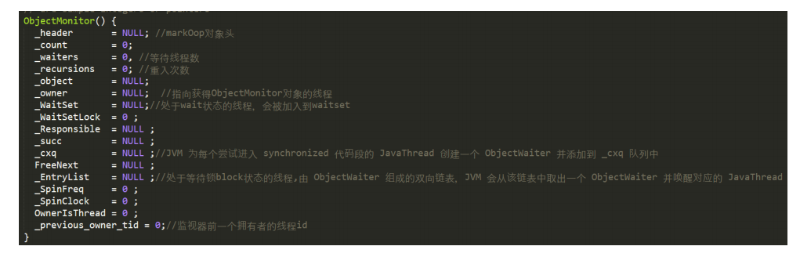
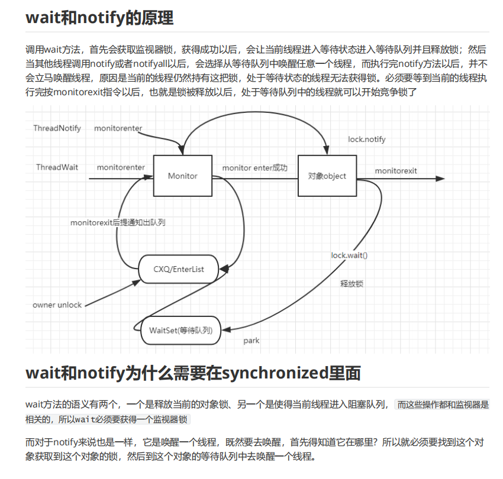

Synchronized

1.synchronized的三种应用方式

　　1.修饰实例方法，作用于当前实例加锁，进入同步代码前要获得当前实例的锁

　　2. 静态方法，作用于当前类对象加锁，进入同步代码前要获得当前类对象的锁

　　3.修饰代码块，指定加锁对象，对给定对象加锁，进入同步代码库前要获得给定对象的锁。

2.synchronized括号后面的对象

　　synchronized扩后后面的对象是一把锁，在java中任意一个对象都可以成为锁，简单来说，我们把object比喻是一
个key，拥有这个key的线程才能执行这个方法，拿到这个key以后在执行方法过程中，这个key是随身携带的，并且
只有一把。如果后续的线程想访问当前方法，因为没有key所以不能访问只能在门口等着，等之前的线程把key放回
去。所以，synchronized锁定的对象必须是同一个，如果是不同对象，就意味着是不同的房间的钥匙，对于访问者
来说是没有任何影响的

3.synchronized的字节码指令

　　通过javap -v 来查看对应代码的字节码指令，对于同步块的实现使用了monitorenter和monitorexit指令，前面我
们在讲JMM的时候，提到过这两个指令，他们隐式的执行了Lock和UnLock操作，用于提供原子性保证。
monitorenter指令插入到同步代码块开始的位置、monitorexit指令插入到同步代码块结束位置，jvm需要保证每
个monitorenter都有一个monitorexit对应。

　　这两个指令，本质上都是对一个对象的监视器(monitor)进行获取，这个过程是排他的，也就是说同一时刻只能有
一个线程获取到由synchronized所保护对象的监视器

　　线程执行到monitorenter指令时，会尝试获取对象所对应的monitor所有权，也就是尝试获取对象的锁；而执行monitorexit，就是释放monitor的所有权

4.synchronized的锁的原理

　　jdk1.6以后对synchronized锁进行了优化，包含偏向锁、轻量级锁、重量级锁; 在了解synchronized锁之前，我们
需要了解两个重要的概念，一个是对象头、另一个是monitor

Java对象头

　　在Hotspot虚拟机中，对象在内存中的布局分为三块区域：对象头、实例数据和对齐填充；Java对象头是实现
synchronized的锁对象的基础，一般而言，synchronized使用的锁对象是存储在Java对象头里。它是轻量级锁和偏
向锁的关键

Mark Word

　　Mark Word用于存储对象自身的运行时数据，如哈希码（HashCode）、GC分代年龄、锁状态标志、线程持有的
锁、偏向线程 ID、偏向时间戳等等。Java对象头一般占有两个机器码（在32位虚拟机中，1个机器码等于4字节，
也就是32bit）

5.synchronized的锁升级和获取过程

　　了解了对象头以及monitor以后，接下来去分析synchronized的锁的实现，就会非常简单了。前面讲过
synchronized的锁是进行过优化的，引入了偏向锁、轻量级锁；锁的级别从低到高逐步升级， 无锁->偏向锁->轻量
级锁->重量级锁.四种状态会随着竞争的情况逐渐升级，而且是不可逆的过程，即不可降级

偏向锁

　　偏向锁的由来：大多数情况下，锁不存在多线程竞争，而是总是由同一线程多次获得时，为了使线程获得锁的代价更低而引入了偏向锁。

　　偏向锁的使用：当线程进入和退出同步块时，需要经历几个测试步骤：

    测试对象头Mark Word(默认存储对象的HashCode,分代年龄，锁标记位)里是否存储着指向当前线程的偏向锁。
    若测试失败，则测试Mark Word中偏向锁标识是否设置成1(表示当前为偏向锁)
    没有设置则使用CAS竞争，否则尝试使用CAS将对象头的偏向锁指向当前线程

　　偏向锁的撤销：当其他线程尝试竞争偏向锁时，就会释放锁，锁的撤销，需要等待全局安全点，分为以下几个步骤：

    暂停拥有偏向锁的线程，检查线程是否存活
    处于非活动状态，则设置为无锁状态
    存活，则重新偏向于其他线程或者恢复到无锁状态或者标记对象不适合作为偏向锁
    唤醒线程

　　偏向锁的升级：当有第二个线程进入同步代码块时，则升级为轻量级锁

轻量级锁

　　轻量级锁的加锁：

    如果成功使用CAS将对象头重的Mark Word替换为指向锁记录的指针，则获得锁，失败则当前线程尝试使用自旋(循环等待)来获取锁。

　　轻量级锁的解锁：

    当有另一个线程与该线程同时竞争时，锁会升级为重量级锁。为了防止继续自旋，一旦升级，将无法降级。

重量级锁

　　重量级锁特点：其他线程试图获取锁时，都会被阻塞，只有持有锁的线程释放锁之后才会唤醒这些线程，进行竞争。

偏向锁

　　大多数情况下，锁不仅不存在多线程竞争，而且总是由同一线程多次获得，为了让线程获得锁的代价更低而引入了
偏向锁。当一个线程访问同步块并获取锁时，会在对象头和栈帧中的锁记录里存储锁偏向的线程ID，以后该线程在
进入和退出同步块时不需要进行CAS操作来加锁和解锁，只需简单地测试一下对象头的Mark Word里是否存储着指
向当前线程的偏向锁。如果测试成功，表示线程已经获得了锁。如果测试失败，则需要再测试一下Mark Word中偏
向锁的标识是否设置成1（表示当前是偏向锁）：如果没有设置，则使用CAS竞争锁；如果设置了，则尝试使用CAS
将对象头的偏向锁指向当前线程

轻量级锁

　　引入轻量级锁的主要目的是在多没有多线程竞争的前提下，减少传统的重量级锁使用操作系统互斥量产生的性能消
耗。当关闭偏向锁功能或者多个线程竞争偏向锁导致偏向锁升级为轻量级锁，则会尝试获取轻量级锁

自旋锁（CAS）

　　自旋锁就是让不满足条件的线程等待一段时间，而不是立即挂起。看持有锁的线程是否能够很快释放锁。怎么自旋
呢？其实就是一段没有任何意义的循环。

　　虽然它通过占用处理器的时间来避免线程切换带来的开销，但是如果持有锁的线程不能在很快释放锁，那么自旋的
线程就会浪费处理器的资源，因为它不会做任何有意义的工作。所以，自旋等待的时间或者次数是有一个限度的，
如果自旋超过了定义的时间仍然没有获取到锁，则该线程应该被挂起

重量级锁

　　重量级锁通过对象内部的监视器（monitor）实现，其中monitor的本质是依赖于底层操作系统的Mutex Lock实
现，操作系统实现线程之间的切换需要从用户态到内核态的切换，切换成本非常高。

Monitor

　　什么是Monitor？我们可以把它理解为一个同步工具，也可以描述为一种同步机制。所有的Java对象是天生的
Monitor，每个object的对象里 markOop->monitor() 里可以保存ObjectMonitor的对象。从源码层面分析一下

monitor对象

　　Ø oop.hpp下的oopDesc类是JVM对象的顶级基类，所以每个object对象都包含markOop

　　Ø markOop.hpp中 markOopDesc继承自oopDesc，并扩展了自己的monitor方法，这个方法返回一个

ObjectMonitor指针对象

　　Ø objectMonitor.hpp,在hotspot虚拟机中，采用ObjectMonitor类来实现monitor

synchronized可重入性

　　同一线程在调用自己类中其他synchronized方法/块或调用父类的synchronized方法/块都不会阻碍该线程的执行，就是说同一线程对同一个对象锁是可重入的，而且同一个线程可以获取同一把锁多次，也就是可以多次重入。

　　但是synchronized属于悲观锁，Synchronized多线程同步，具有排他性，所以容易产生死锁。