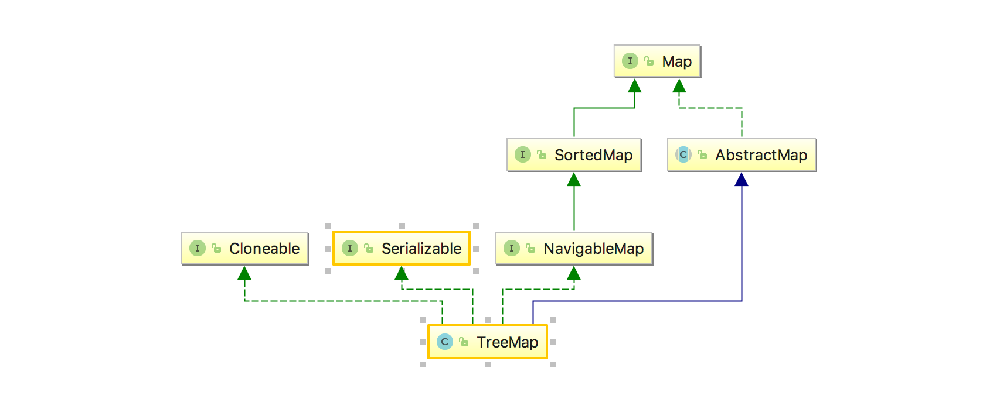
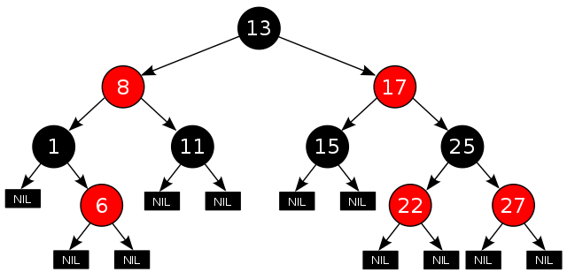
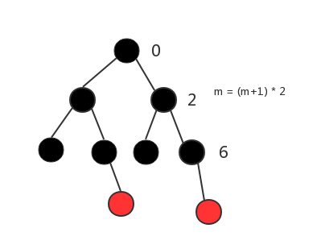

一、前言

在前面两篇随笔中，我们提到过，当HashMap的桶过大的时候，会自动将链表转化成红黑树结构，当时一笔带过，因为我们将留在本章中，针对TreeMap进行详细的了解。


二、TreeMap的继承关系

下面先让我们来看一下TreeMap的继承关系，对它有一个大致的了解：



可以看到，除了在之前HashMap里常见的继承类和接口以外，TreeMap实现了NavigableMap接口，而NavigableMap继承自SortedMap，由名字可以看出，只是一个用来实现排序的接口。而这也是为什么TreeMap能够实现排序的原因。由于篇幅关系，将TreeMap的源码解析分为三部分，本章将对接口NavigableMap以及SortedMap进行解析。

三、SortedMap接口源码解析

3.1 SortedMap接口

```java
public interface SortedMap<K,V> extends Map<K,V> {
  //返回用于对键的进行排序的比较器，如果此映射使用其键的自然排序，则为null
  Comparator<? super K> comparator();
  //返回从fromKey（包括）到toKey（不包括）之间的map
  SortedMap<K,V> subMap(K fromKey, K toKey);
  //返回小于toKey的map
  SortedMap<K,V> headMap(K toKey);
  //返回大于或等于fromKey的map
  SortedMap<K,V> tailMap(K fromKey);
  //返回map中第一个（最低）键
  K firstKey();
  //返回map中最后一个（最高）键
  K lastKey();
  Set<K> keySet();
  Collection<V> values();
  Set<Map.Entry<K, V>> entrySet();
}
```

SortedMap的接口比较简单，没有很特别的地方，唯一比较特别的就是返回Comparator这个接口，可以设想实现排序功能的秘密或许就藏在此处。下面让我们来看一下Comparator和Comparable接口，两者之间有点关联，可以理解为Comparable自带了比较功能，而Comparator是赋予没有比较能力的对象一种比较能力。举个简单例子：面对一道计算题，小明天生口算能力很强，看一眼就能算出来答案。而小李没有这种能力，需要借助计算器才能得出答案。

3.2 Comparable接口

```java
public interface Comparable<T> {
  //如果小于o，返回负数；等于o，返回0；大于o返回正数。
  public int compareTo(T o);
}
```

里面传入一个泛型T的对象o，对o进行比较。如果小于o，返回负数；等于o，返回0；大于o返回正数。

我们熟悉的很多对象如String，Integer，Double等都实现了这个接口。可以来看一下简单的例子：
```java
public class Item implements Comparable<Item> {
  private String name;
  private int price;
  
  public Item(String name, int price) {
    this.name = name;
    this.price = price;
  }
  
  public int getPrice() {
    return price;
  }
  
  public String getName() {
    return name;
  }
  
  @Override
  public String toString() {
    return "Item{" +
      "name='" + name + '\'' +
      ", price=" + price +
      '}';
  }
  
  @Override
  public int compareTo(Item o) {
    if (this.name.compareTo(o.name) < 0) {
      return -1;
    } else if (this.name.compareTo(o.name) > 0) {
      return 1;
    } else {
      return 0;
    }
  }
  
  public static void main(String[] args) {
    List<Item> items = Arrays.asList(new Item("banana", 200), new Item("apple", 400));
    System.out.println("before:" + items);
    Collections.sort(items);
    System.out.println("after:" + items);
  }
}
```

上述main函数的输出：

    before:[Item{name='banana', price=200}, Item{name='apple', price=400}]
    after:[Item{name='apple', price=400}, Item{name='banana', price=200}]
    
上面的例子中，我们自己实现了Comparable接口，比较了Item的name属性，然后通过Collections.sort对它进行了排序（值得注意的是：没有实现Comparable接口的对象不能使用该方法）。但是，如果我不想用name属性对它进行排序，想对price进行排序呢，或者先对name排序，相同的话在对price进行排序呢，用这个不就没法实现了吗。这就需要提到了下面的Comparator接口


3.3 Comparator接口

照例先来看一下代码：
```java
@FunctionalInterface
public interface Comparator<T> {
  // 核心方法，用来比较两个对象，如果o1小于o2，返回负数；等于o2，返回0；大于o2返回正数
  int compare(T o1, T o2);
  // 好像很少用到，一般都用对象自带的equals
  boolean equals(Object obj);
  
  /**-----------下面的都是JDK1.8新增的接口，挑几个放进去----------*/

  //返回反向排序比较器
  default Comparator<T> reversed() {
    return Collections.reverseOrder(this);
  }
  //根据名字知道，先进行compare比较后，再进行一次比较
  default Comparator<T> thenComparing(Comparator<? super T> other) {
    Objects.requireNonNull(other);
    return (Comparator<T> & Serializable) (c1, c2) -> {
      int res = compare(c1, c2);
      return (res != 0) ? res : other.compare(c1, c2);
    };
  }
  //对int类型的key进行比较
  public static <T> Comparator<T> comparingInt(ToIntFunction<? super T> keyExtractor) {
    Objects.requireNonNull(keyExtractor);
    return (Comparator<T> & Serializable)
      (c1, c2) -> Integer.compare(keyExtractor.applyAsInt(c1), keyExtractor.applyAsInt(c2));
  }
  //返回正常顺序的比较器
  public static <T extends Comparable<? super T>> Comparator<T> naturalOrder() {
    return (Comparator<T>) Comparators.NaturalOrderComparator.INSTANCE;
  }
}
```

一起来看一下如何使用，先来看一下JDK1.8以前的用法：
```java
public class SimpleComparator implements Comparator<Item> {
  @Override
  public int compare(Item o1, Item o2) {
    return o1.price - o2.price;
  }
  
  public static void main(String[] args) {
    List<Item> items = Arrays.asList(new Item("banana", 200), new Item("apple", 400), new Item("Orange", 100));
    Collections.sort(items, new SimpleComparator());
    System.out.println(items);
  }
}
```

上述main函数的输出是：

    [Item{name='Orange', price=100}, Item{name='banana', price=200}, Item{name='apple', price=400}]
JDK1.8以前的用法要自己手动实现Comparator接口，然后调用Collections.sort()，传入实现类来完成排序，非常麻烦，而JDK1.8则相对来说简单了很多：
```java
public static void main(String[] args) {
  List<Item> items = Arrays.asList(new Item("banana", 200), new Item("apple", 400), new Item("Orange", 100));
  Collections.sort(items, (Item a, Item b) -> a.price - b.price);
  System.out.println(items);
}
```

甚至，我们可以不使用Collections.sort：

    public static void main(String[] args) {
      List<Item> items = Arrays.asList(new Item("banana", 100), new Item("Orange", 100), new Item("apple", 400), new Item("Orange", 50));
      items.sort((Item a, Item b) -> a.price - b.price);
      System.out.println(items);
      //使用上面的thenComparing
      items.sort(Comparator.comparing(Item::getName).thenComparing(Comparator.comparingInt(Item::getPrice)));
      System.out.println("after using thenComparing: " + items); 
    }
上述main函数的输出：

     [Item{name='orange', price=50}, Item{name='banana', price=100}, Item{name='orange', price=100}, Item{name='apple', price=400}]
     after using thenComparing: [Item{name='apple', price=400}, Item{name='banana', price=100}, Item{name='orange', price=50}, Item{name='orange', price=100}]


四、NavigableMap接口源码解析

    public interface NavigableMap<K,V> extends SortedMap<K,V> {
      //返回键小于且最接近Key（不包含等于）的键值对，没有返回null
      Map.Entry<K,V> lowerEntry(K key);
      //返回小于且最接近（不包含等于）Key的键，没有返回null
      K lowerKey(K key);
      //返回键小于且最接近（包含等于）Key的键值对，没有返回null
      Map.Entry<K,V> floorEntry(K key);
      //返回小于且最接近（包含等于）Key的键，没有返回null
      K floorKey(K key);
      //返回大于且最接近（包含等于）给定key的键值对，没有返回null
      Map.Entry<K,V> ceilingEntry(K key);
      //同上
      K ceilingKey(K key);
      //返回大于且最接近（不包含等于）给定key的键值对
      Map.Entry<K,V> higherEntry(K key);
      //同上
      K higherKey(K key);
      //返回第一个Entry
      Map.Entry<K,V> firstEntry();
      //返回最后一个Entry
      Map.Entry<K,V> lastEntry();
      //移除并返回第一个Entry
      Map.Entry<K,V> pollFirstEntry();
      //同上
      Map.Entry<K,V> pollLastEntry();
      //返回map中包含的映射关系的逆序视图
      NavigableMap<K,V> descendingMap();
      //返回map中包含的键的NavigableSet视图。 set的迭代器按key的升序
      NavigableSet<K> navigableKeySet();
      //逆序
      NavigableSet<K> descendingKeySet();
      //根据fromKey和toKey来返回子map，两个boolean参数用于是否包含该key
      NavigableMap<K,V> subMap(K fromKey, boolean fromInclusive,
                                 K toKey,   boolean toInclusive);
      //返回小于（或等于,根据inclusive）toKey的map
      NavigableMap<K,V> headMap(K toKey, boolean inclusive);
      //返回大于（或等于,根据inclusive）fromKey的map
      NavigableMap<K,V> tailMap(K fromKey, boolean inclusive);
      SortedMap<K,V> subMap(K fromKey, K toKey);
      SortedMap<K,V> headMap(K toKey);
      SortedMap<K,V> tailMap(K fromKey);
    }
注意：上述返回的map与原map是相互影响的。

四、 TreeMap的结构

TreeMap的内部实现就是一个红黑树。



对于红黑树的定义：

    节点是红色或黑色。
    根是黑色。
    所有叶子都是黑色（叶子是NIL节点）。
    每个红色节点必须有两个黑色的子节点。（从每个叶子到根的所有路径上不能有两个连续的红色节点。）
    从任一节点到其每个叶子的所有简单路径都包含相同数目的黑色节点。

五、Tree源码解析

5.1 TreeMap的成员变量

    public class TreeMap<K,V> extends AbstractMap<K,V>
        implements NavigableMap<K,V>, Cloneable, java.io.Serializable {
        // Key的比较器，用作排序
        private final Comparator<? super K> comparator;
        //树的根节点
        private transient Entry<K,V> root;
        //树的大小
        private transient int size = 0;
        //修改计数器
        private transient int modCount = 0;
        //返回map的Entry视图
        private transient EntrySet entrySet;
        private transient KeySet<K> navigableKeySet;
        private transient NavigableMap<K,V> descendingMap;
        //定义红黑树的颜色
        private static final boolean RED   = false;
        private static final boolean BLACK = true;
      
    }


5.2 TreeMap的构造方法
对一些不重要的构造方法就不流水账一样的记录了。

5.2.1 TreeMap(Comparator<? super K> comparator)

    public TreeMap(Comparator<? super K> comparator) {
      this.comparator = comparator;
    }
允许用户自定义比较器进行key的排序。


5.2.2 public TreeMap(Map<? extends K, ? extends V> m)

    public TreeMap(Map<? extends K, ? extends V> m) {
      comparator = null;
      putAll(m);
    }

    public void putAll(Map<? extends K, ? extends V> map) {
      int mapSize = map.size();
      //判断map是否SortedMap，不是则采用AbstractMap的putAll
      if (size==0 && mapSize!=0 && map instanceof SortedMap) {
        Comparator<?> c = ((SortedMap<?,?>)map).comparator();
        //同为null或者不为null，类型相同，则进入有序map的构造
        if (c == comparator || (c != null && c.equals(comparator))) {
          ++modCount;
          try {
            buildFromSorted(mapSize, map.entrySet().iterator(),
                            null, null);
          } catch (java.io.IOException cannotHappen) {
          } catch (ClassNotFoundException cannotHappen) {
          }
          return;
        }
      }
      super.putAll(map);
    }
buildFromSorted将在后面解析，因为后面的构造函数也调用了这个方法。


3.2.3 public TreeMap(SortedMap<K, ? extends V> m)

    public TreeMap(SortedMap<K, ? extends V> m) {
      comparator = m.comparator();
      try {
        buildFromSorted(m.size(), m.entrySet().iterator(), null, null);
      } catch (java.io.IOException cannotHappen) {
      } catch (ClassNotFoundException cannotHappen) {
      }
    }
下面让我们来看一下这个buildFromSorted方法：

    /**
    * size: map里键值对的数量
    * it: 传入的map的entries迭代器
    * str: 如果不为空，则从流里读取key-value
    * defaultVal：见名知意，不为空，则value都用这个值
    */
    private void buildFromSorted(int size, Iterator<?> it,
                                     java.io.ObjectInputStream str,
                                     V defaultVal)
      throws  java.io.IOException, ClassNotFoundException {
      this.size = size;
      root = buildFromSorted(0, 0, size-1, computeRedLevel(size),
                             it, str, defaultVal);
    }
我们先来分析一下computeRedLevel方法：

    private static int computeRedLevel(int sz) {
      int level = 0;
      for (int m = sz - 1; m >= 0; m = m / 2 - 1)
        level++;
      return level;
    }
它的作用是用来计算完全二叉树的层数。什么意思呢，先来看一下下面的图：



把根结点索引看为0，那么高度为2的树的最后一个节点的索引为2，类推高度为3的最后一个节点为6，满足m = (m + 1) * 2。那么计算这个高度有什么好处呢，如上图，如果一个树有9个节点，那么我们构造红黑树的时候，只要把前面3层的结点都设置为黑色，第四层的节点设置为红色，则构造完的树，就是红黑树，满足前面提到的红黑树的5个条件。而实现的关键就是找到要构造树的完全二叉树的层数。

了解了上面的原理，后面就简单了，接着来看buildFromSorted方法：

    /**
    * level: 当前树的层数，注意：是从0层开始
    * lo: 子树第一个元素的索引
    * hi: 子树最后一个元素的索引
    * redLevel: 上述红节点所在层数
    * 剩下的3个就不解释了，跟上面的一样
    */
    @SuppressWarnings("unchecked")
    private final Entry<K,V> buildFromSorted(int level, int lo, int hi,
                                             int redLevel,
                                             Iterator<?> it,
                                             java.io.ObjectInputStream str,
                                             V defaultVal)
      throws  java.io.IOException, ClassNotFoundException {
      // hi >= lo 说明子树已经构造完成
      if (hi < lo) return null;
      // 取中间位置，无符号右移，相当于除2
      int mid = (lo + hi) >>> 1;
      Entry<K,V> left  = null;
      //递归构造左结点
      if (lo < mid)
        left = buildFromSorted(level+1, lo, mid - 1, redLevel,
                               it, str, defaultVal);
      K key;
      V value;
      // 通过迭代器获取key， value
      if (it != null) {
        if (defaultVal==null) {
          Map.Entry<?,?> entry = (Map.Entry<?,?>)it.next();
          key = (K)entry.getKey();
          value = (V)entry.getValue();
        } else {
          key = (K)it.next();
          value = defaultVal;
        }
      // 通过流来读取key, value
      } else {
        key = (K) str.readObject();
        value = (defaultVal != null ? defaultVal : (V) str.readObject());
      }
      //构建结点
      Entry<K,V> middle =  new Entry<>(key, value, null);
      // level从0开始的，所以上述9个节点，计算出来的是3，实际上就是代表的第4层
      if (level == redLevel)
        middle.color = RED;
      //如果存在的话，设置左结点，
      if (left != null) {
        middle.left = left;
        left.parent = middle;
      }
      // 递归构造右结点
      if (mid < hi) {
        Entry<K,V> right = buildFromSorted(level+1, mid+1, hi, redLevel,
                                           it, str, defaultVal);
        middle.right = right;
        right.parent = middle;
      }
      return middle;
    }
另外提一句，buildFromSorted能这么构造是因为这是一个已经排序的map。:-) 
具体的构造顺序如下图（偷懒画了个简单的 ）:

5.3 TreeMap的重要方法

接下来，我们来看一下TreeMap里的一些重要的方法。

5.3.1 get(Object key)

对于map来说，根据key来获取value几乎是最常见的操作，下面我们来看一下：

    public V get(Object key) {
      //内部调用了getEntry方法。
      Entry<K,V> p = getEntry(key);
      return (p==null ? null : p.value);
    }
    
    final Entry<K,V> getEntry(Object key) {
      // 如果有比较器，则调用通过比较器的来比较key的方法
      if (comparator != null)
        return getEntryUsingComparator(key);
      if (key == null)
        throw new NullPointerException();
      @SuppressWarnings("unchecked")
      // 获取key的Comparable接口
      Comparable<? super K> k = (Comparable<? super K>) key;
      //从根结点开始比较，根据二叉树的形式，小的往左树找，大的往右树找，直到找到返回
      Entry<K,V> p = root;
      while (p != null) {
        int cmp = k.compareTo(p.key);
        if (cmp < 0)
          p = p.left;
        else if (cmp > 0)
          p = p.right;
        else
          return p;
      }
      return null;
    }
对于Comparable<? super K> k = (Comparable<? super K>) key;，笔者一开始的时候在想为什么用<? super K>，用<? extends K>不行吗，不是根据PECS（Producer Extends, Consumer Super）原则，取出来的时候用extends吗。后来发现太傻了 T^T，这一原则是用来针对list的。这里肯定是用super，用K或者K的父类的compareTo方法。如果用extends的话，K的子类加了其他属性进行比较，那就根本没法进行比较了。

至于getEntryUsingComparator方法就不分析了，就是把compareTo变成了用Comparator进行比较，有兴趣的园友可以自己看看。


3.3.2 put(K key, V value)
    
    public V put(K key, V value) {
      Entry<K,V> t = root;
      //根结点为空，则进行添加根结点并初始化参数
      if (t == null) {
        //用来进行类型检查
        compare(key, key);
        root = new Entry<>(key, value, null);
        size = 1;
        modCount++;
        return null;
      }
      int cmp;
      Entry<K,V> parent;
      // 与get类型，分离comparator与comparable的比较
      Comparator<? super K> cpr = comparator;
      if (cpr != null) {
        //循环查找key，如果找到则替换value，没有则记录其parent，后面进行插入
        do {
          parent = t;
          cmp = cpr.compare(key, t.key);
          if (cmp < 0)
            t = t.left;
          else if (cmp > 0)
            t = t.right;
          else
            return t.setValue(value);
        } while (t != null);
      }
      else {
        if (key == null)
          throw new NullPointerException();
        @SuppressWarnings("unchecked")
        Comparable<? super K> k = (Comparable<? super K>) key;
        //循环查找key，如果找到则替换value，没有则记录其parent，后面进行插入
        do {
          parent = t;
          cmp = k.compareTo(t.key);
          if (cmp < 0)
            t = t.left;
          else if (cmp > 0)
            t = t.right;
          else
            return t.setValue(value);
        } while (t != null);
      }
      //创建结点，然后比较与parent的大小，小放在左结点，大放在右节点
      Entry<K,V> e = new Entry<>(key, value, parent);
      if (cmp < 0)
        parent.left = e;
      else
        parent.right = e;
      //对红黑树进行修复
      fixAfterInsertion(e);
      size++;
      modCount++;
      return null;
    }
put的逻辑还是比较清晰的，关键在于fixAfterInsertion对插入结点后的红黑树进行修复，维护其平衡，我们接着来看看它是如何实现的（在继续看之前，建议园友们先去了解一下左旋转和右旋转的操作）。
    
    private void fixAfterInsertion(Entry<K,V> x) {
      //约定插入的结点都是红节点
      x.color = RED;
      //x本身红色，如果其父节点也是红色，违反规则4，进行循环处理
      while (x != null && x != root && x.parent.color == RED) {
        //父节点是左结点
        if (parentOf(x) == leftOf(parentOf(parentOf(x)))) {
          //获取父节点的右兄弟y
          Entry<K,V> y = rightOf(parentOf(parentOf(x)));
          //p为左结点，y为红色 ①
          if (colorOf(y) == RED) {
            setColor(parentOf(x), BLACK);
            setColor(y, BLACK);
            setColor(parentOf(parentOf(x)), RED);
            x = parentOf(parentOf(x));
          } else {
            // p为左结点，y为黑，x为右节点 ②
            if (x == rightOf(parentOf(x))) {
              x = parentOf(x);
              rotateLeft(x);
            }
            // p为左结点，y为红，x为左结点 ③
            setColor(parentOf(x), BLACK);
            setColor(parentOf(parentOf(x)), RED);
            rotateRight(parentOf(parentOf(x)));
          }
        //父节点是右结点  
        } else {
          Entry<K,V> y = leftOf(parentOf(parentOf(x)));
          //p为右结点，y为红色 ④
          if (colorOf(y) == RED) {
            setColor(parentOf(x), BLACK);
            setColor(y, BLACK);
            setColor(parentOf(parentOf(x)), RED);
            x = parentOf(parentOf(x));
          } else {
            //p为右结点，y为黑色，x为左结点 ⑤
            if (x == leftOf(parentOf(x))) {
              x = parentOf(x);
              rotateRight(x);
            }
            //p为右结点，y为黑色，x为右结点 ⑥
            setColor(parentOf(x), BLACK);
            setColor(parentOf(parentOf(x)), RED);
            rotateLeft(parentOf(parentOf(x)));
          }
        }
      }
      //约定根结点都是黑节点
      root.color = BLACK;
    }
总结一下有这么几种情况：

由于p为红，则x没有兄弟结点（原则4），要想插入后维持红黑树平衡，必须从p，pp以及p的兄弟结点y中找到对应的处理情况来平衡。
首先，插入的结点x，颜色肯定是红色，插入位置两种情况——左结点或者右结点。
其次，父结点p肯定为红色，因为父节点p为黑色的话，那就不用调整了（插入红节点对原则五并没有印象），所以只有父结点p是左结点和右结点的两种情况。
既然父结点p为红色，那么父父结点pp肯定为黑色（根据原则四），那么p的兄弟节点y，存在两种情况，颜色为红或者黑。
所以综上，x插入要调整的所有情况有：2 * 2 * 2 = 8种，但是当y为红色的时候不用调整，不需要考虑x的插入位置，所以8 - 2 = 6种，且只要懂三种就够了，剩余的是左右对称的。至于为什么要这么处理这里就不展开了。感兴趣的园友们可以推荐这篇看一下：红黑树的插入操作

至于左旋转和右旋转就不拿出来分析了。


3.3.3 remove(Object key)
最后我们再来看一下remove方法：
    
    public V remove(Object key) {
      //获取Entry
      Entry<K,V> p = getEntry(key);
      if (p == null)
        return null;
      V oldValue = p.value;
      //删除的关键方法
      deleteEntry(p);
      return oldValue;
    }
在看deleteEntry之前，我们先来看一下successor方法，为其做准备：
    
    //查找t的后继结点
    static <K,V> TreeMap.Entry<K,V> successor(Entry<K,V> t) {
      if (t == null)
        return null;
      //从t的右子树中找到最小的
      else if (t.right != null) {
        Entry<K,V> p = t.right;
        while (p.left != null)
          p = p.left;
        return p;
      //当右子树为空时，向上找到第一个左父节点
      } else {
        Entry<K,V> p = t.parent;
        Entry<K,V> ch = t;
        while (p != null && ch == p.right) {
          ch = p;
          p = p.parent;
        }
        return p;
      }
    }
上述的目的是找到最接近且大于t的结点，这样的话，直接用来替换掉t，对原有的树结构变动最小。

    private void deleteEntry(Entry<K,V> p) {
      modCount++;
      size--;
      //① p的左右子树都不为空，找到右子树中最小的结点，将key、value赋给p，然后p指向后继结点
      if (p.left != null && p.right != null) {
        Entry<K,V> s = successor(p);
        p.key = s.key;
        p.value = s.value;
        p = s;
      } 
      //获取p中不为空的结点，也可能两个都是空的
      Entry<K,V> replacement = (p.left != null ? p.left : p.right);
      //① 替换的结点有一个子节点
      if (replacement != null) {
        replacement.parent = p.parent;
        if (p.parent == null)
          root = replacement;
        else if (p == p.parent.left)
          p.parent.left  = replacement;
        else
          p.parent.right = replacement;
        //清空链接，以便可以使用fixAfterDeletion和内存回收
        p.left = p.right = p.parent = null;
        if (p.color == BLACK)
          fixAfterDeletion(replacement);
      // ② 删除的结点是根结点
      } else if (p.parent == null) { 
        root = null;
      // ③ 替换的结点是空节点
      } else {
        if (p.color == BLACK)
          fixAfterDeletion(p);
        if (p.parent != null) {
          if (p == p.parent.left)
            //清空链接，方便GC
            p.parent.left = null;
          else if (p == p.parent.right)
            p.parent.right = null;
          //清空链接，方便GC
          p.parent = null;
        }
      }
    }
整体思路是：

当删除结点p的左右结点都不为空的时候，选择大于且最接近p的后继结点s，直接将s的key、value替换掉p的原有值，然后对后继结点s做删除处理。此时的s必有一个左必为空，做操作2
对于有左右结点有一个为空的p时，在不为空的结点replacement，与p的parent之间修改父子节点间引用关系
两个结点都是空的就更简单了，直接删掉
对于删除的黑色的结点进行fix
在获取replacement的时候，p的左右结点为空的个数>=1，

没有进前面if条件，则说明p至少有一个为空
进入if条件，则在p的右树中找最小节点s，s左结点必为空，右结点可能存在
下面让我们来看一下fixAfterDeletion的源码的源码：
    
    private void fixAfterDeletion(Entry<K,V> x) {
      while (x != root && colorOf(x) == BLACK) {
        //x是左结点且为黑色
        if (x == leftOf(parentOf(x))) {
          //获取兄弟右节点
          Entry<K,V> sib = rightOf(parentOf(x));
          //① 兄弟右节点sib颜色是红色
          if (colorOf(sib) == RED) {
            setColor(sib, BLACK);
            setColor(parentOf(x), RED);
            rotateLeft(parentOf(x));
            sib = rightOf(parentOf(x));
          }
          //② sib的子节点都是黑色
          if (colorOf(leftOf(sib))  == BLACK &&
              colorOf(rightOf(sib)) == BLACK) {
            setColor(sib, RED);
            x = parentOf(x);
          //sib子节点不全为黑
          } else {
            //③ sib右子节点为黑色
            if (colorOf(rightOf(sib)) == BLACK) {
              setColor(leftOf(sib), BLACK);
              setColor(sib, RED);
              rotateRight(sib);
              sib = rightOf(parentOf(x));
            }
            // ④
            setColor(sib, colorOf(parentOf(x)));
            setColor(parentOf(x), BLACK);
            setColor(rightOf(sib), BLACK);
            rotateLeft(parentOf(x));
            x = root;
          }
        // 对称
        } else {
          Entry<K,V> sib = leftOf(parentOf(x));
    
          if (colorOf(sib) == RED) {
            setColor(sib, BLACK);
            setColor(parentOf(x), RED);
            rotateRight(parentOf(x));
            sib = leftOf(parentOf(x));
          }
    
          if (colorOf(rightOf(sib)) == BLACK &&
              colorOf(leftOf(sib)) == BLACK) {
            setColor(sib, RED);
            x = parentOf(x);
          } else {
            if (colorOf(leftOf(sib)) == BLACK) {
              setColor(rightOf(sib), BLACK);
              setColor(sib, RED);
              rotateLeft(sib);
              sib = leftOf(parentOf(x));
            }
            setColor(sib, colorOf(parentOf(x)));
            setColor(parentOf(x), BLACK);
            setColor(leftOf(sib), BLACK);
            rotateRight(parentOf(x));
            x = root;
          }
        }
      }
      setColor(x, BLACK);
    }
fixAfterDeletion总体思路是：由于删除的结点x是黑色，所以在该结点的树上做调整没法使红黑树恢复平衡，所以要依靠x的兄弟结点sib做文章，依靠p结点以及sib和其子结点，将x的黑色结点+1，这里具体就不展开了。


