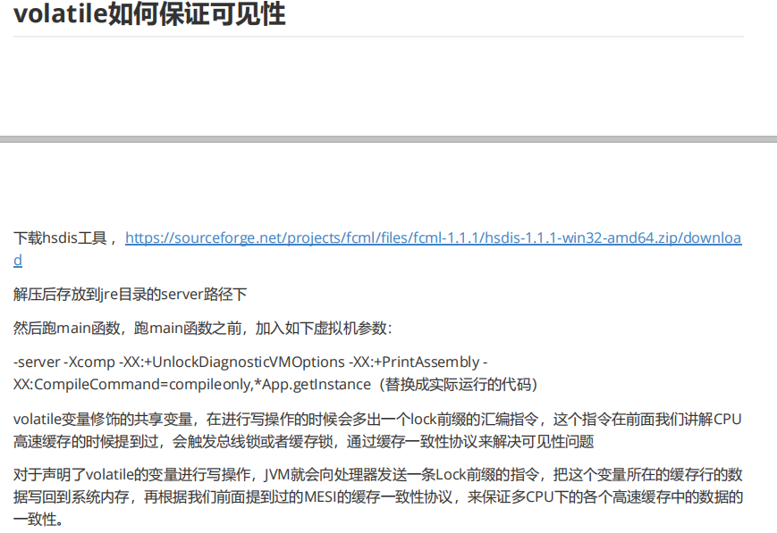
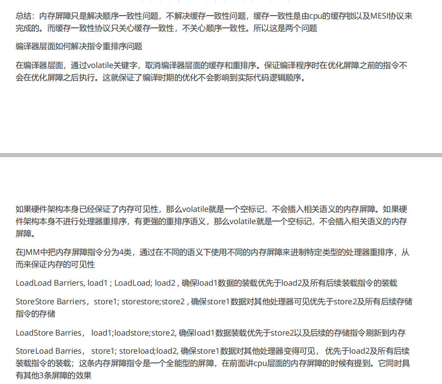
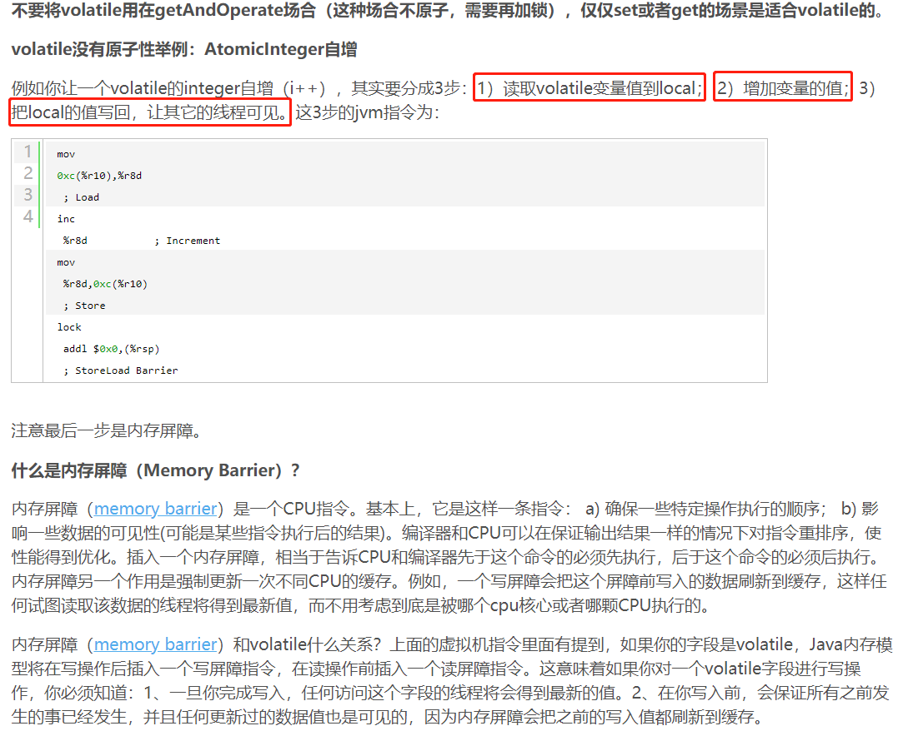

Volatile

Volatile写

　　当写一个volatile变量时，JMM会把线程对应的本地内存中的共享变量值刷新到主内存。

Volatile读

　　当读一个volatile变量时，JMM会把该线程对应的本地内存置为无效。线程接下来从主内存中读取共享变量。

　　下面对volatile写和volatile读的内存语义做一个总结：

　　线程A写一个volatile变量，实质上是线程A向接下来将要读这个volatile变量的某个线程发出了（其对共享变量所作修改的）消息。

　　线程B读一个volatile变量，实质上是线程B接受了某个线程发出的（在写这个volatile变量之前对共享变量所做修改的）消息

　　线程A写一个volatile变量，随后线程B读一个volatile变量，实质上就是线程A通过主内存向线程B发送消息

Volatile内存语义的实现

　　在每个volatile写操作的前面插入一个StoreStore屏障

　　在每个volatile写操作的后面插入一个StoreLoad屏障

　　在每个volatile读操作的前面插入一个LoadLoad屏障

　　在每个volatile读操作的后面插入一个LoadStore屏障

　　对一个volatile变量的读，总是能看到（任意线程）对这个volatile变量最后的写入

volatile为什么没有原子性?

　　对任意单个volatile变量的读写具有原子性，但类似于 volatile++这种复合操作不具有原子性 

　　明白了内存屏障（memory barrier）这个CPU指令，回到前面的JVM指令：从Load到store到内存屏障，一共4步，其中最后一步jvm让这个最新的变量的值在所有线程可见，也就是最后一步让所有的CPU内核都获得了最新的值，但中间的几步（从Load到Store）是不安全的，中间如果其他的CPU修改了值将会丢失。
